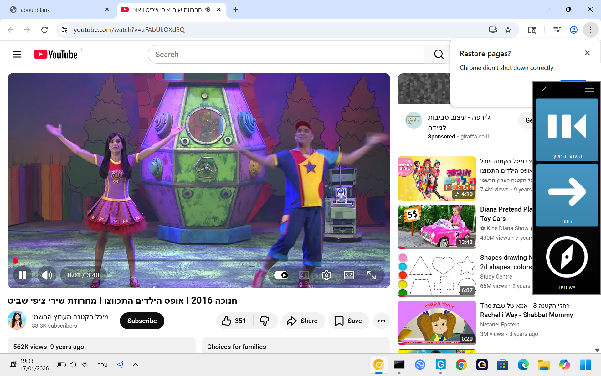

# Grid3-YouTube-Accessibility-Addon

A desktop app bridging Grid 3 AAC software with Chrome Canary to enable hands-free YouTube control for eye-tracking and switch-access users. Features home/Shorts navigation, search with scrolling, and automatic "Skip Ad" clicking the moment the button appears.

> **Docs:** [Setup & Customization Guide — For Parents, Teachers & Therapists](docs/SETUP.md) | [Architecture](ARCHITECTURE.md)

---

## Technology Stack

 &nbsp;&nbsp;&nbsp;&nbsp;&nbsp;  &nbsp;&nbsp;&nbsp;&nbsp;&nbsp;  &nbsp;&nbsp;&nbsp;&nbsp;&nbsp;  &nbsp;&nbsp;&nbsp;&nbsp;&nbsp; 

| Technology | Role |
|---|---|
| **Node.js (v18)** | Core runtime for `nav.exe` and `skip_ads.exe` |
| **Chrome DevTools Protocol (CDP)** | Controls Chrome Canary from Node.js |
| **Chrome Canary** | Browser running YouTube with remote debugging on port `15432` |
| **Grid 3 (Tobii Dynavox)** | AAC software — sends commands via `wscript.exe` + `send.vbs` |
| **VBScript (`send.vbs`)** | Translates Grid 3 cell presses into HTTP calls to `nav.exe` |
| **Batch Script (`Setup_System.bat`)** | Master launcher — manages processes and starts the system |
| **Inno Setup Compiler** | Packages everything into `Output/YouTube_V6_Full_Installer.exe` |
| **`pkg`** | Compiles Node.js scripts into standalone Windows `.exe` files |

---

## Methods Used in the Code

### `youtube_navigator.js` → `nav.exe`
- **`ensureSkipperRunning()`** — Checks `tasklist` for `skip_ads.exe`, starts it if missing
- **`navigateYouTube(action, query)`** — Main dispatcher: connects to CDP, runs JS in YouTube page
- **`delay(ms)`** — Promise-based pause utility used between page loads and interactions
- **HTTP `createServer`** — Listens on port `3000`, decodes UTF-8 URL path to extract `action` and `query`

### `skip_ads_cdp_V6.js` → `skip_ads.exe`
- **`logger(message, forceConsole)`** — Deduplicating file+console logger with timestamp
- **`CHROME_CONFIG`** — CDP connection config (`127.0.0.1:15432`)

### `send.vbs`
- **`UTF8EncodeForUrl(sStr)`** — Encodes any string (including Hebrew) to percent-encoded UTF-8 for use in URLs
- **Main body** — Reads `WScript.Arguments(0)`, encodes it, fires HTTP GET via `MSXML2.XMLHTTP` to `http://localhost:3000/<action>`

### `Setup_System.bat`
- **Process cleanup** — Kills leftover `nav.exe`, `skip_ads.exe`, `chrome.exe` before each launch
- **Chrome launch** — Starts Chrome Canary with `--remote-debugging-port=15432` and a dedicated user data directory
- **Server start** — Starts `nav.exe` minimized and waits for it to be ready

### `inno_setup_v6.iss`
- **`[Setup]`** — App name, version, required admin privileges, icon
- **`[Files]`** — Bundles `nav.exe`, `skip_ads.exe`, `Setup_System.bat`, `send.vbs`, icon
- **`[Dirs]`** — Creates `C:\YouTube_User_Data_V5\` with full user permissions
- **`[Icons]`** — Desktop shortcut to launch, Start Menu shortcut to exit
- **`[Run]`** — Configures Windows Defender exclusions on install

---

## Creating skip_ads.exe

To create the `skip_ads.exe` executable from `skip_ads_cdp_V6.js`:

```bash
cd src
npx pkg skip_ads_cdp_V6.js --target node18-win-x64 --output skip_ads.exe --public
```

---

## Creating nav.exe

To create the `nav.exe` executable from `youtube_navigator.js`:

```bash
cd src
npx pkg youtube_navigator.js --target node18-win-x64 --output nav.exe --public
```

### Required Dependencies (for both)

```bash
# Install pkg globally
npm install -g pkg

# Install project dependencies
npm install chrome-remote-interface
```

> Node.js **v18** is required. Download from [nodejs.org](https://nodejs.org/).

---

## YouTube Accessibility Controller for Eye-Tracking Users

**Grid3-YouTube-Accessibility-Addon** is a desktop application that integrates **Grid 3** communication software with **Chrome Canary**, giving YouTube navigation and control abilities to users relying on eye-tracking or switch-based assistive technology.

### Key Features

- **Navigate YouTube Home** — Browse recommended videos with Grid buttons (using computer-control grids)
- **Control Shorts** — Scroll through Shorts and interact with the feed hands-free
- **Navigate "Up Next"** — Browse the next/recommended videos while a video is playing
- **YouTube Search** — Enter pre-determined queries and scroll through search results using gaze or switches
- **Automatic "Skip Ad" Clicker** — Instantly clicks the "Skip Ad" button as soon as it appears, solving accessibility problems where the button is hard to find or triggers only on hover

---

## How It Works

- The program runs in the background, automatically starting when the matching Grid 3 set/command is activated.
- Launches **Chrome Canary** on port **15432** and opens YouTube’s home page, placing the browser window behind the active Grid 3 window for seamless interaction.
- Runs a background "Skip Ads" process (`skip_ads.exe`) that constantly monitors for and clicks the "Skip Ad" button to help users who can’t reach or time the click manually.
- Accepts commands from Grid cells via port **3000**: Each cell in Grid 3 represents a YouTube action (e.g., scroll, next video, search, Shorts navigation). When a user triggers a cell, the grid sends a script command (with parameters, like search terms) to the running app.
- During navigation, the currently focused item on YouTube is outlined in red for clear visual feedback.
- Actions include: open/close tab, go home, search, scroll, activate videos, toggle fullscreen, like, navigate Shorts, and more.

---

## Grid 3 Command Reference

Each cell in the Grid 3 set runs `wscript.exe` with `send.vbs` and the action name as arguments.

> **Note:** YouTube search supports both **English and Hebrew** queries. Hebrew characters are automatically UTF-8 encoded by `send.vbs`.

| Button | Arguments | What It Does |
|---|---|---|
| Home | `"C:\YouTube_Navigator_V6\send.vbs" home` | Go to YouTube home page |
| Down | `"C:\YouTube_Navigator_V6\send.vbs" down` | Move red highlight to next item / next Short |
| Up | `"C:\YouTube_Navigator_V6\send.vbs" up` | Move red highlight to previous item / previous Short |
| Select | `"C:\YouTube_Navigator_V6\send.vbs" enter` | Open highlighted video |
| Back | `"C:\YouTube_Navigator_V6\send.vbs" back` | Go back to previous page |
| Play / Pause | `"C:\YouTube_Navigator_V6\send.vbs" play_pause` | Toggle play/pause |
| Fullscreen | `"C:\YouTube_Navigator_V6\send.vbs" fullscreen` | Toggle fullscreen mode |
| Like | `"C:\YouTube_Navigator_V6\send.vbs" like` | Like the current video |
| Search | `"C:\YouTube_Navigator_V6\send.vbs" "search:your query"` | Search YouTube (English or Hebrew) |
| Open URL | `"C:\YouTube_Navigator_V6\send.vbs" "open:https://youtu.be/..."` | Open a specific video or playlist |
| Exit | `"C:\YouTube_Navigator_V6\send.vbs" exit` | Safely shut down the entire system |

For full setup instructions see [docs/SETUP.md](docs/SETUP.md).

---

## Visual Overview

### Example of YouTube Interface with Accessibility Features


### Application Icon


---

## Customization for Specific Users

This application is designed to be highly adaptable to individual user needs. All adjustments are made entirely through the **Grid 3 set** — no software changes are ever required. Buttons can be removed, reordered, or replaced to match each user's motor and cognitive capabilities. Pre-set search buttons or direct video links can be added for a user's favourite content without any developer involvement.

For a full guide see [docs/SETUP.md](docs/SETUP.md).

---

## Architecture

For a detailed breakdown of how all components connect, see [ARCHITECTURE.md](ARCHITECTURE.md).

---

## Repository

GitHub: [ReneDva/Grid3-YouTube-Accessibility-Addon](https://github.com/ReneDva/Grid3-YouTube-Accessibility-Addon.git)