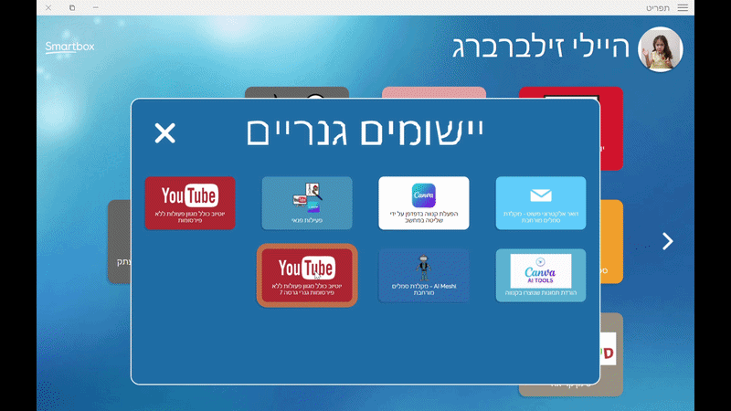

# Grid3-YouTube-Accessibility-Addon (V7)
 ![.NET 10](https://img.shields.io/badge/.NET_10-512BD4?style=for-the-badge&logo=&logoColor=white)      ![Accessibility](https://img.shields.io/badge/Accessibility-AAC%20%26%20AT-1B1B1B?style=for-the-badge&logo=data%3Aimage%2Fsvg%2Bxml%3Bbase64%2CPHN2ZyB4bWxucz0iaHR0cDovL3d3dy53My5vcmcvMjAwMC9zdmciIHZpZXdCb3g9IjAgMCAxMjIuODggMTIyLjg4Ij48cGF0aCBmaWxsPSJ3aGl0ZSIgZD0iTTYxLjQ0LDBBNjEuNDYsNjEuNDYsMCwxLDEsMTgsMTgsNjEuMjEsNjEuMjEsMCwwLDEsNjEuNDQsMFptLS4zOSw3NC4xOEw1Mi4xLDk4LjkxYTQuOTQsNC45NCwwLDAsMS0yLjU4LDIuODNBNSw1LDAsMCwxLDQyLjcsOTUuNWw2LjI0LTE3LjI4YTI2LjMsMjYuMywwLDAsMCwxLjE3LTQsNDAuNjQsNDAuNjQsMCwwLDAsLjU0LTQuMThjLjI0LTIuNTMuNDEtNS4yNy41NC03LjlzLjIyLTUuMTguMjktNy4yOWMuMDktMi42My0uNjItMi44LTIuNzMtMy4zbC0uNDQtLjEtMTgtMy4zOUE1LDUsMCwwLDEsMjcuMDgsNDZhNSw1LDAsMCwxLDUuMDUtNy43NGwxOS4zNCwzLjYzYy43Ny4wNywxLjUyLjE2LDIuMzEuMjVhNTcuNjQsNTcuNjQsMCwwLDAsNy4xOC41M0E4MS4xMyw4MS4xMywwLDAsMCw2OS45LDQyYy45LS4xLDEuNzUtLjIxLDIuNi0uMjlsMTguMjUtMy40MkE1LDUsMCwwLDEsOTQuNSwzOWE1LDUsMCwwLDEsMS4zLDcsNSw1LDAsMCwxLTMuMjEsMi4wOUw3NS4xNSw1MS4zN2MtLjU4LjEzLTEuMS4yMi0xLjU2LjI5LTEuODIuMzEtMi43Mi40Ny0yLjYxLDMuMDYuMDgsMS44OS4zMSw0LjE1LjYxLDYuNTEuMzUsMi43Ny44MSw1LjcxLDEuMjksOC40LjMxLDEuNzcuNiwzLjE5LDEsNC41NXMuNzksMi43NSwxLjM5LDQuNDJsNi4xMSwxNi45YTUsNSwwLDAsMS02LjgyLDYuMjQsNC45NCw0Ljk0LDAsMCwxLTIuNTgtMi44M0w2Myw3NC4yMyw2Miw3Mi40bC0xLDEuNzhabS4zOS01My41MmE4LjgzLDguODMsMCwxLDEtNi4yNCwyLjU5LDguNzksOC43OSwwLDAsMSw2LjI0LTIuNTlabTM2LjM1LDQuNDNhNTEuNDIsNTEuNDIsMCwxLDAsMTUsMzYuMzUsNTEuMjcsNTEuMjcsMCwwLDAtMTUtMzYuMzVaIi8%2BPC9zdmc%2B) ![Eye Tracking](https://img.shields.io/badge/Eye%20Tracking-Supported-0F6E56?style=for-the-badge&logo=data%3Aimage%2Fsvg%2Bxml%3Bbase64%2CPHN2ZyB4bWxucz0iaHR0cDovL3d3dy53My5vcmcvMjAwMC9zdmciIGZpbGw9Im5vbmUiIHZpZXdCb3g9IjAgMCAyNCAyNCI%2BPHBhdGggZmlsbD0id2hpdGUiIGQ9Ik0yLjUgMjNjLTAuNCAwLTAuNzUtMC4xNS0xLjA1LTAuNDVzLTAuNDUtMC42NS0wLjQ1LTEuMDV2LTIuMzI1YzAtMC40MjUgMC4xNDMtMC43ODEgMC40My0xLjA2OHMwLjY0My0wLjQzMiAxLjA3LTAuNDMyYzAuNDI3IDAgMC43ODMgMC4xNDQgMS4wNjYgMC40MzJzMC40MjQgMC42NDMgMC40MjQgMS4wNjhWMjFoMi4zMjVjMC40MjUgMCAwLjc4MSAwLjE0NCAxLjA2OCAwLjQzMnMwLjQzMiAwLjY0NyAwLjQzMiAxLjA3NWMwIDAuNDI3LTAuMTQ0IDAuNzgzLTAuNDMyIDEuMDY2cy0wLjY0MyAwLjQyNy0xLjA2OCAwLjQyN0gyLjVabTE5IDBoLTIuMzI1Yy0wLjQyNSAwLTAuNzgxLTAuMTQ0LTEuMDY4LTAuNDMycy0wLjQzMi0wLjY0Ny0wLjQzMi0xLjA3NWMwLTAuNDI3IDAuMTQ0LTAuNzgzIDAuNDMyLTEuMDY2czAuNjQzLTAuNDI3IDEuMDY4LTAuNDI3SDIxdi0yLjMyNWMwLTAuNDI1IDAuMTQ0LTAuNzgxIDAuNDMyLTEuMDY4czAuNjQ3LTAuNDMyIDEuMDc1LTAuNDMyYzAuNDI3IDAgMC43ODMgMC4xNDQgMS4wNjYgMC40MzJzMC40MjcgMC42NDMgMC40MjcgMS4wNjhWMjEuNWMwIDAuNC0wLjE1IDAuNzUtMC40NSAxLjA1cy0wLjY1IDAuNDUtMS4wNSAwLjQ1Wm0tOS41LTQuNjI1Yy0xLjgxNyAwLTMuNDc1LTAuNDc5LTQuOTc1LTEuNDM4cy0yLjY5Mi0yLjI3OS0zLjU3NS0zLjk2MmMtMC4xNjctMC4zMTctMC4yNS0wLjY0Mi0wLjI1LTAuOTc1czAuMDgzLTAuNjU4IDAuMjUtMC45NzVjMC44ODMtMS43IDIuMDc1LTMuMDI5IDMuNTc1LTMuOTg4czMuMTU4LTEuNDM3IDQuOTc1LTEuNDM3IDMuNDc5IDAuNDc5IDQuOTg4IDEuNDM3NSAyLjcwNCAyLjI4NzUgMy41ODc1IDMuOTg3NWMwLjE2NyAwLjMxNyAwLjI1IDAuNjQyIDAuMjUgMC45NzVzLTAuMDgzIDAuNjU4LTAuMjUgMC45NzVjLTAuODgzIDEuNjgzLTIuMDc5IDMuMDA0LTMuNTg4IDMuOTYycy0zLjE3MSAxLjQzOC00Ljk4NyAxLjQzOFptMC0zLjA3NWMwLjkxMyAwIDEuNjk1LTAuMzIzIDIuMzQ0LTAuOTY4czAuOTc1LTEuNDI1IDAuOTc1LTIuMzM4LTAuMzI0LTEuNjk1LTAuOTczLTIuMzQ0LTEuNDMyLTAuOTc1LTIuMzUtMC45NzUtMS42OTggMC4zMjQtMi4zMzkgMC45NzMtMC45NjMgMS40MzItMC45NjMgMi4zNSAwLjMyMyAxLjY5OCAwLjk2OCAyLjMzOSAxLjQyNSAwLjk2MyAyLjMzOCAwLjk2M1ptMC0xLjVjLTAuNSAwLTAuOTI1LTAuMTc1LTEuMjc1LTAuNTI1cy0wLjUyNS0wLjc3NS0wLjUyNS0xLjI3NSAwLjE3NS0wLjkyOSAwLjUyNS0xLjI4OCAwLjc3NS0wLjUzNyAxLjI3NS0wLjUzNyAwLjkyOSAwLjE3NyAxLjI4OCAwLjUzMiAwLjUzNyAwLjc4NiAwLjUzNyAxLjI5My0wLjE3NyAwLjkyNS0wLjUzMiAxLjI3NS0wLjc4NiAwLjUyNS0xLjI5MyAwLjUyNVpNNC44MjUgMi41SDIuNXYzLjA3NUgxVjIuNWMwLTAuNCAwLjE1LTAuNzUgMC40NS0xLjA1UzIuMSAxIDIuNSAxaDIuMzI1YzAuNDI1IDAgMC43ODEgMC4xNDMgMS4wNjggMC40M3MwLjQzMiAwLjY0MyAwLjQzMiAxLjA3LTAuMTQ0IDAuNzgzLTAuNDMyIDEuMDY2LTAuNjQzIDAuNDI0LTEuMDY4IDAuNDI0Wk0yMyAyLjV2Mi4zMjVjMCAwLjQyNS0wLjE0NCAwLjc4MS0wLjQzMiAxLjA2OHMtMC42NDcgMC40MzItMS4wNzUgMC40MzItMC43ODMtMC4xNDQtMS4wNjYtMC40MzItMC40MjctMC42NDMtMC40MjctMS4wNjhWMi41aC0yLjMyNWMtMC40MjUgMC0wLjc4MS0wLjE0My0xLjA2OC0wLjQzcy0wLjQzMi0wLjY0My0wLjQzMi0xLjA3IDAuMTQ0LTAuNzgzIDAuNDMyLTEuMDY2IDAuNjQzLTAuNDI0IDEuMDY4LTAuNDI0SDIxLjVjMC40IDAgMC43NSAwLjE1IDEuMDUgMC40NXMwLjQ1IDAuNjUgMC40NSAxLjA1WiIvPjwvc3ZnPg%3D%3D) ![License](https://img.shields.io/badge/License-MIT-1B1B1B?style=for-the-badge&logo=data%3Aimage%2Fsvg%2Bxml%3Bbase64%2CPHN2ZyB4bWxucz0iaHR0cDovL3d3dy53My5vcmcvMjAwMC9zdmciIGZpbGw9Im5vbmUiIHZpZXdCb3g9IjAgMCAyNCAyNCI%2BPHBhdGggZmlsbD0id2hpdGUiIGQ9Ik0xMiAxMi43NWMtMC43NjcgMC0xLjQxNy0wLjI2Ny0xLjk1LTAuOHMtMC44LTEuMTgzLTAuOC0xLjk1IDAuMjY3LTEuNDE3IDAuOC0xLjk1IDEuMTgzLTAuOCAxLjk1LTAuOCAxLjQxNyAwLjI2NyAxLjk1IDAuOCAwLjggMS4xODMgMC44IDEuOTUtMC4yNjcgMS40MTctMC44IDEuOTUtMS4xODMgMC44LTEuOTUgMC44Wm0wIDguMjc1LTQuOSAxLjY1Yy0wLjIzMyAwLjA4My0wLjQ1OCAwLjA0Ni0wLjY3NS0wLjExMy0wLjIxNy0wLjE1OC0wLjMyNS0wLjM2Mi0wLjMyNS0wLjYxMlYxNS40Yy0wLjc1LTAuNzgzLTEuMjg4LTEuNjQyLTEuNjEzLTIuNTc1QzQuMTYzIDExLjg5MiA0IDEwLjk1IDQgMTBjMC0yLjI2NyAwLjc2Ny00LjE2NyAyLjMtNS43QzcuODMzIDIuNzY3IDkuNzMzIDIgMTIgMnM0LjE2NyAwLjc2NyA1LjcgMi4zQzE5LjIzMyA1LjgzMyAyMCA3LjczMyAyMCAxMGMwIDAuOTUtMC4xNjMgMS44OTItMC40ODggMi44MjUtMC4zMjUgMC45MzMtMC44NjIgMS43OTItMS42MTIgMi41NzV2Ni41NWMwIDAuMjUtMC4xMDggMC40NTQtMC4zMjUgMC42MTMtMC4yMTcgMC4xNTgtMC40NDIgMC4xOTUtMC42NzUgMC4xMTJsLTQuOS0xLjY1Wk0xMiAxNi41YzEuODE3IDAgMy4zNTQtMC42MjkgNC42MTMtMS44ODhDMTcuODcxIDEzLjM1NCAxOC41IDExLjgxNyAxOC41IDEwYzAtMS44MTctMC42MjktMy4zNTQtMS44ODgtNC42MTNDMTUuMzU0IDQuMTI5IDEzLjgxNyAzLjUgMTIgMy41Yy0xLjgxNyAwLTMuMzU0IDAuNjI5LTQuNjEzIDEuODg4QzYuMTI5IDYuNjQ2IDUuNSA4LjE4MyA1LjUgMTBjMCAxLjgxNyAwLjYyOSAzLjM1NCAxLjg4OCA0LjYxM0M4LjY0NiAxNS44NzEgMTAuMTgzIDE2LjUgMTIgMTYuNVoiLz48L3N2Zz4%3D)


If you are a parent, teacher, therapist, or installer, start with the V7 user guide: [docs/SETUP_V7.md](docs/SETUP_V7.md).
Low-level runtime behavior (focus restoration, profile migration internals, IPC lifecycle) is documented only in this technical README and in [src/SYSTEM_STATE.md](src/SYSTEM_STATE.md).
<p align="center">
  
</p>

## Overview

Grid3-YouTube-Accessibility-Addon V7 is a Windows background controller that connects Grid 3 command cells to YouTube in Chrome through CDP (Chrome DevTools Protocol).

V7 replaced the old V6 script chain (`send.vbs` + HTTP + `nav.exe`) with a single C# executable that runs in two modes:

- Leader mode: resident controller process
- Messenger mode: short-lived command relay process

This removes command-window flicker, removes HTTP command transport from runtime, and centralizes lifecycle control in one process.

---

## Documentation Map

Use this map based on your current task.

| Developer Journey | Start Here | Then Continue To |
|---|---|---|
| Discovery | [Overview](#overview) | [Core Concepts and Architecture](#core-concepts-and-architecture) |
| Evaluation | [Technology Stack](#technology-stack) | [Supported Command Reference](#supported-command-reference) |
| First Implementation | [Getting Started](#getting-started) | [Build, Test, and Packaging](#build-test-and-packaging) |
| Troubleshooting | [Troubleshooting](#troubleshooting) | [Validation and Advanced Operations](#validation-and-advanced-operations) |
| Advanced Usage | [Validation and Advanced Operations](#validation-and-advanced-operations) | [Release Notes and Branch History](#implementation-notes-release-notes-and-branch-history) |

---

## Getting Started

### Prerequisites

- Windows 10/11
- .NET 10 SDK
- Chrome Canary (preferred runtime target; stable fallback logic exists)
- Inno Setup 6 (required only to build installer)

### Quick Start (Developer)

Run from repository root.

```powershell
dotnet build src/YouTubeControl/YouTubeControl.csproj
dotnet test tests/YouTubeControl.Tests/YouTubeControl.Tests.csproj
dotnet publish src/YouTubeControl/YouTubeControl.csproj -c Release -r win-x64 --self-contained true -p:PublishSingleFile=true -p:PublishAot=true
```

Published binary:

```text
src/YouTubeControl/bin/Release/net10.0-windows/win-x64/publish/YouTubeControl.exe
```

### First Runtime Check

```powershell
cd C:\YouTube_Navigator_V7
.\YouTubeControl.exe
.\YouTubeControl.exe home
.\YouTubeControl.exe stop
```

### Local Focus Validation (Manual)

Use this check to validate that launching Leader keeps Chrome startup behavior while returning focus to the caller window.

```cmd
C:\YouTube_Navigator_V7\YouTubeControl.exe
```

Expected behavior:

- Chrome Canary opens.
- Within roughly 1-3 seconds, focus returns to the original caller window (CMD/Grid launcher).

Repeat 5 cycles for confidence:

```cmd
C:\YouTube_Navigator_V7\YouTubeControl.exe exit
C:\YouTube_Navigator_V7\YouTubeControl.exe
```

Pass criteria:

- Focus returns to the caller window in at least 4 out of 5 launch cycles.

Log evidence (in `logs/logs.txt`):

- Success: `Foreground restore sequence completed successfully on attempt ...` or `... on final pass.`
- Failure: `Foreground restore sequence did not restore the previous window.`

---

## Core Concepts and Architecture

### Core Technical References

- Active runtime architecture document: [ARCHITECTURE.md](ARCHITECTURE.md)
- Runtime flow and behavior reference: [src/SYSTEM_STATE.md](src/SYSTEM_STATE.md)
- V7 migration design and rollout notes: [docs/Architecture_Design.V7-plan.md](docs/Architecture_Design.V7-plan.md)

### Runtime Model (V7)

| Component | Responsibility |
|---|---|
| YouTubeControl.exe (Leader) | Owns CDP session, receives commands, executes actions, runs ad-skipper, controls shutdown |
| YouTubeControl.exe <action> (Messenger) | Sends one command to Leader over named pipe and exits quickly |
| Named Pipe (YouTubeControlPipe) | Local low-latency command transport |
| Global Mutex | Single-leader election (`Global\\YouTubeControl_Leader_Mutex`) |
| ChromeManager | Chrome discovery/launch, debug port wiring, user-data directory handling |
| UserDataDirectoryPolicy | Canonical profile path selection, legacy migration, first-install bootstrap decision |

### Execution Workflow (Daily Use)

1. **Leader Startup:**
   `YouTubeControl.exe` (no args) starts the Leader process. It launches Chrome and stays resident.
2. **Command Relay:**
   `YouTubeControl.exe <action>` (e.g., `down`) starts a Messenger process. It sends the command to the Leader via pipe and exits.

---

## Technology Stack

| Area | Technology | Version / Notes |
|---|---|---|
| Primary language | C# | .NET 10 (`net10.0-windows`) |
| Runtime model | WinExe + WinForms capability | Headless background process with Windows app manifest |
| Browser automation | PuppeteerSharp | NuGet: `PuppeteerSharp` `24.40.0` |
| IPC | Named Pipes | `System.IO.Pipes`, pipe name `YouTubeControlPipe` |
| Browser protocol | CDP | Debug endpoint on port `15432` |
| Ad skipping | In-process background task | Poll interval `1500ms` |
| Build / packaging | .NET CLI + Inno Setup | Installer script: `src/inno_setup_v7.iss` |
| Test framework | xUnit + Microsoft.NET.Test.Sdk + Coverlet | Tests in `tests/YouTubeControl.Tests` |
| Utility scripting | PowerShell | Regression sequence runner in `scripts/` |

### Languages and Artifacts

- C# (.NET): runtime, IPC server/client, command dispatch, browser lifecycle, logging
- JavaScript (embedded/injected): browser-side navigation and ad-skip logic via CDP evaluation
- PowerShell: sequence-based validation workflows
- Inno Setup script: Windows installer generation

---

## Supported Command Reference

| Command | Description |
|---|---|
| home | Navigate to YouTube home and normalize interaction state |
| up | Move highlight to previous item |
| down | Move highlight to next item |
| enter | Activate highlighted item |
| back | Browser history back |
| play_pause | Toggle player state |
| fullscreen | Toggle fullscreen mode |
| toggle | Alias for fullscreen path |
| like | Toggle like action where supported |
| search:<query> | Open YouTube search results |
| open:<url> | Open explicit URL |
| refresh | Reload active page |
| exit | Close browser and terminate leader |
| stop | Alias for exit |

---

## Build, Test, and Packaging

### Build

```powershell
dotnet build src/YouTubeControl/YouTubeControl.csproj
```

### Unit Tests

```powershell
dotnet test tests/YouTubeControl.Tests/YouTubeControl.Tests.csproj
```

### Publish Release Binary (single-file AOT)

```powershell
dotnet publish src/YouTubeControl/YouTubeControl.csproj -c Release -r win-x64 --self-contained true -p:PublishSingleFile=true -p:PublishAot=true
```

Expected output:

```text
src/YouTubeControl/bin/Release/net10.0-windows/win-x64/publish/YouTubeControl.exe
```

### Build Installer

```powershell
"C:\Program Files (x86)\Inno Setup 6\ISCC.exe" "src\inno_setup_v7.iss"
```

Expected output:

```text
Output/YouTube_V7_Full_Installer.exe
```

### Deploy to Target Machine (V7)

1. Copy `Output/YouTube_V7_Full_Installer.exe` to the target machine.
2. Run the installer as Administrator.
3. Confirm app files are installed to `C:\YouTube_Navigator_V7`.
4. Launch once for validation:

```powershell
C:\YouTube_Navigator_V7\YouTubeControl.exe
```

5. Optional shutdown check:

```powershell
C:\YouTube_Navigator_V7\YouTubeControl.exe exit
```

### User Profile Data Path (V7)

V7 runtime uses a canonical Chrome user-data directory:

```text
C:\YouTube_User_Data
```

Behavior:

- If `C:\YouTube_User_Data` already has profile data (`Default\Login Data` or `Default\Preferences`), runtime uses it directly.
- If canonical path has no profile data but a legacy V7 path contains data (`C:\Grid3_YouTube_Accessibility_Addon_User_Data`), runtime migrates profile data to `C:\YouTube_User_Data` and then uses the canonical path.
- If neither path has profile data, runtime bootstraps first install at `C:\YouTube_User_Data`; manual sign-in is required only for this first-time state.
- On software updates with existing profile data, manual sign-in should not be required again.

---

## Repository Layout

```text
src/
  YouTubeControl/
    Program.cs
    LeaderMode.cs
    MessengerMode.cs
    ChromeManager.cs
    Logger.cs
    Actions/
      NavigationActions.cs
      AdSkipperTask.cs
    Models/
      AppConfig.cs

tests/
  YouTubeControl.Tests/

scripts/
  run_youtubecontrol_sequence.ps1

docs/
  SETUP_V7.md
  SETUP_V6.md
  Architecture_Design.V7-plan.md
```

---

## Troubleshooting

| Problem | What to check |
|---|---|
| Commands do nothing | Confirm Leader is running first (`YouTubeControl.exe` with no args) |
| Browser does not open | Verify Chrome Canary exists and launch path is available |
| Command cell fails in Grid 3 | Ensure each cell runs `YouTubeControl.exe <action>` |
| Search/open command fails | Validate command format: `search:<query>` or `open:<url>` |
| Shutdown fails | Use `exit` or `stop` explicitly |
| Chrome was closed manually with X and next launch is stuck | End `YouTubeControl.exe` from Task Manager or restart your computer  and launch again; this should resolve the stale state and allow normal operation to resume |

---

## Validation and Advanced Operations

### Automated full-sequence validation

```powershell
powershell -ExecutionPolicy Bypass -File ./scripts/run_youtubecontrol_sequence.ps1
```

Stop on first failure:

```powershell
powershell -ExecutionPolicy Bypass -File ./scripts/run_youtubecontrol_sequence.ps1 -StopOnFailure
```

### Local Testing Without Grid 3 (quick check)

```powershell
cd C:\YouTube_Navigator_V7
.\YouTubeControl.exe
# wait until Chrome opens
.\YouTubeControl.exe home
.\YouTubeControl.exe down
.\YouTubeControl.exe enter
.\YouTubeControl.exe play_pause
.\YouTubeControl.exe like
.\YouTubeControl.exe fullscreen
.\YouTubeControl.exe refresh
.\YouTubeControl.exe search: disney songs
.\YouTubeControl.exe open: https://www.youtube.com/shorts
.\YouTubeControl.exe stop # exit also works as a shutdown command
```

### Manual runtime smoke test (full command coverage)

```powershell
cd C:\YouTube_Navigator_V7
.\YouTubeControl.exe
.\YouTubeControl.exe home
.\YouTubeControl.exe down
.\YouTubeControl.exe up
.\YouTubeControl.exe enter
.\YouTubeControl.exe back

.\YouTubeControl.exe play_pause
.\YouTubeControl.exe play_pause

.\YouTubeControl.exe fullscreen
.\YouTubeControl.exe fullscreen
.\YouTubeControl.exe toggle

.\YouTubeControl.exe like
.\YouTubeControl.exe like

.\YouTubeControl.exe search:disney songs
.\YouTubeControl.exe down
.\YouTubeControl.exe enter

.\YouTubeControl.exe open:https://www.youtube.com/shorts
.\YouTubeControl.exe down

.\YouTubeControl.exe refresh

.\YouTubeControl.exe stop
```

---

## Implementation Notes, Release Notes, and Branch History

Implementation notes:

- V7 runtime does not use the old V6 HTTP command-server model
- Grid 3 command cells should call `YouTubeControl.exe <action>` directly
- Ad skipping is integrated in-process in `AdSkipperTask` (no external `skip_ads.exe` dependency)
- Legacy V6 assets may exist for migration/reference purposes only

Branch references:

- Current version branch (active/default): [main](https://github.com/ReneDva/Grid3-YouTube-Accessibility-Addon/tree/main)
- Older V6 baseline snapshot branch: [backup/v6-script-http-baseline](https://github.com/ReneDva/Grid3-YouTube-Accessibility-Addon/tree/backup/v6-script-http-baseline)
