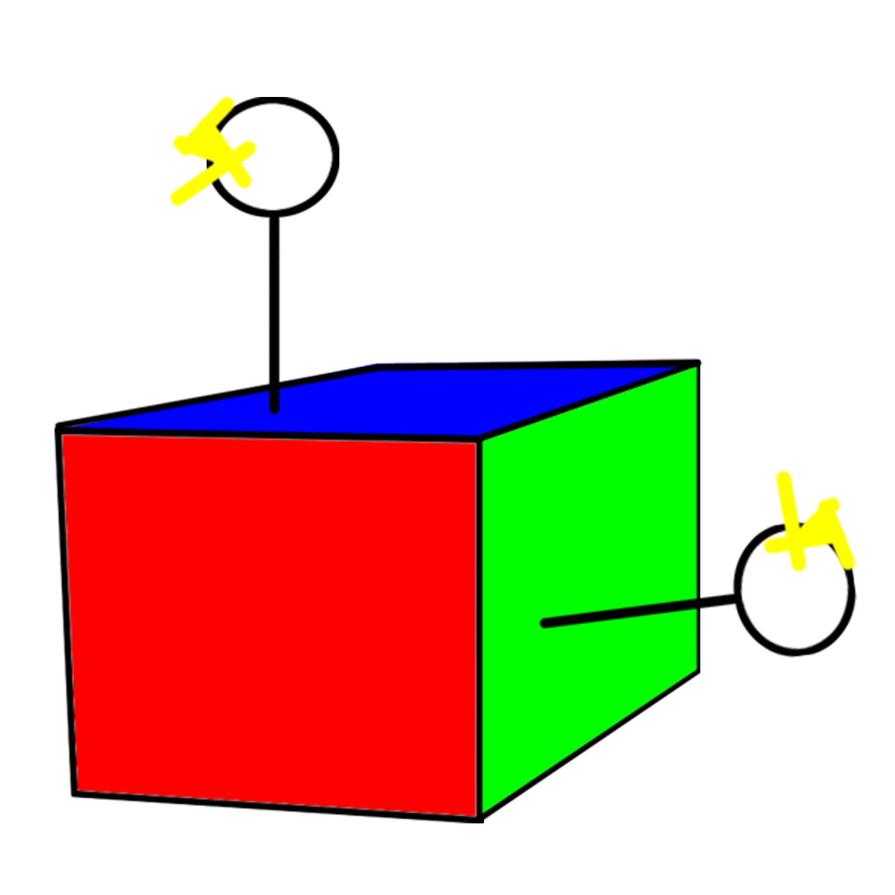

# Setup & Customization Guide — For Parents, Teachers & Therapists

This guide walks through everything needed to install and configure the YouTube Accessibility system on a user's computer, including how to set up the Grid 3 set to control it.

---

## Prerequisites

Before installing, ensure the following are available on the computer:

<table>
<thead><tr><th style="width: 320px;">Requirement</th><th>Notes</th></tr></thead>
<tbody>
<tr><td><strong>Windows 10 or 11</strong> </td><td>Required OS</td></tr>
<tr><td><strong>Chrome Canary</strong> </td><td>Must be installed at <code>%LOCALAPPDATA%\Google\Chrome SxS\Application\chrome.exe</code></td></tr>
<tr><td><strong>Grid 3</strong> </td><td>Tobii Dynavox AAC software — must be installed and licensed</td></tr>
<tr><td><span style="display: inline-block; transform: translateY(-15px);"><strong>YouTube_V6_Full_Installer.exe</strong></span> </td><td>The installer from the <code>Output/</code> folder of this repository</span></td></tr>
</tbody>
</table>

---

## Installation

1. Double-click `Output\YouTube_V6_Full_Installer.exe`.
2. Follow the on-screen prompts and approve the Administrator permission request.
3. That's it — the installer handles everything automatically:
   - Copies all files to `C:\YouTube_Navigator_V6\`.
   - Creates the user data directory `C:\YouTube_User_Data_V6\`.
   - Adds a desktop shortcut to launch the system.
   - Adds a Start Menu shortcut to exit the system cleanly.
   - Configures Windows Defender exclusions to prevent false positives.

---

## Starting the System (Daily Use)

`Setup_System.bat` is the launcher that opens YouTube and starts the command server (`nav.exe`) so the grid set can control it. It runs automatically every time the student opens the YouTube grid set in Grid 3 — **no manual double-clicking is needed**.

What it does when triggered:

1. Kills any leftover processes from a previous session.
2. Launches **Chrome Canary** with remote debugging enabled on port `15432`.
3. Starts **`nav.exe`** (the command server) minimized — this is what listens for commands sent by the Grid 3 set.
4. Opens YouTube's home page automatically.

### Setting Up Automatic Launch via Grid Commands

To make `Setup_System.bat` run automatically every time the student opens the YouTube grid set, use Grid 3's **Grid Commands** feature:

1. Open the YouTube grid set in **Edit Mode**.
2. Click the **Grid** tab in the top menu.
3. Select **"Grid commands"**.
4. Under **"When this grid opens"**, add a new command:
   - Set the action type to **Computer Control**.

   

5. Choose **"Start program"** as the action.

   

6. Set the program to:
   - **Program:** `C:\YouTube_Navigator_V6\Setup_System.bat`
   - Leave parameters empty.
7. Save and exit Edit Mode.

Now every time the student navigates to the YouTube grid set, `Setup_System.bat` launches automatically in the background — Chrome Canary opens and the system is ready to receive commands before the student even presses a button.

---

## Configuring Grid 3

Each button in the Grid 3 set sends a command to the YouTube system using `wscript.exe` and the `send.vbs` script installed on the user's computer.

### About Computer Control Mode

> ⚠️ **Important:** Computer Control is only available on **Windows**. The YouTube grid set must operate in **Computer Control** mode — commands will not work in any other mode.

Computer Control in Grid 3 is designed for users accessing their device with a **head pointer or eye gaze**. When Computer Control is launched, Grid 3 shrinks to the right-hand side of the screen, giving access to Windows applications with a control overlay that allows clicking, dragging, typing, and more.

When the YouTube grid set is active in Computer Control mode:
- Grid 3 stays visible on the side of the screen while Chrome Canary with YouTube runs behind it.
- The student uses their gaze or pointer to select cells on the grid set, which send commands to YouTube.
- No direct interaction with the browser window is needed — everything is controlled through Grid cells.

Key Computer Control options relevant to this setup:
- **Start program** — used to launch `Setup_System.bat` automatically when the grid set opens.
- **Run Programs** — used to send commands via `wscript.exe` and `send.vbs` for each YouTube action.
- **Back to chat / Grid Explorer** — returns the student to the main Grid 3 set and (with the exit command added) shuts down YouTube and Chrome Canary.


### How to Configure a Cell

Each YouTube control button must be configured as a **"Run Programs"** cell under Computer Control actions in Grid 3:

- **Action type:** Run Programs (under Computer Control)
- **Program / Application:** `wscript.exe` 
- **Parameters / Arguments:** The specific command for that button — for example:
  - `"C:\YouTube_Navigator_V6\send.vbs" home` — go to the YouTube home page
  - `"C:\YouTube_Navigator_V6\send.vbs" play_pause` — play or pause the video
  - See the full command table below for all available actions.


---

### Closing the System When the Student Leaves the Grid Set (Grid Explorer Cell)

The YouTube grid set should include a **"Go to Grid Explorer"** button (or equivalent "Home" / "Back to main grid" button) that returns the student to the main navigation grid set. This cell should **also shut down YouTube and Chrome Canary** when pressed, so no background software keeps running after the student has left.

**Steps in Grid 3 (for the Grid Explorer / Home cell):**

1. Open the YouTube grid set in **Edit Mode** and select the **Grid Explorer cell**.
2. The cell already has a *Jump to grid* or *Grid Explorer* action — **keep that action as-is**.
3. Add a **second action** to the same cell, placed **before** the navigate action:
   - **Action type:** Run Application / Computer Control
   - **Application / File:** `wscript.exe`
   - **Arguments:** `"C:\YouTube_Navigator_V6\send.vbs" exit`
4. Save and exit edit mode.

Now when the student presses the Grid Explorer button:
- **First:** `send.vbs exit` safely shuts down `nav.exe`, `skip_ads.exe`, and Chrome Canary.
- **Then:** Grid 3 navigates back to the Grid Explorer / main grid set as normal.

This ensures no background processes are left running after the student finishes watching YouTube.

---

### Grid 3 Commands Reference

> **Note:** YouTube search works with both English and Hebrew queries. Hebrew characters are automatically encoded by `send.vbs`.

#### Navigation & Playback

| Button Label | Arguments | What It Does |
|---|---|---|
| Home | `"C:\YouTube_Navigator_V6\send.vbs" home` | Go to YouTube home page |
| Down | `"C:\YouTube_Navigator_V6\send.vbs" down` | Move red highlight to next video / next Short |
| Up | `"C:\YouTube_Navigator_V6\send.vbs" up` | Move red highlight to previous video / previous Short |
| Select / Enter | `"C:\YouTube_Navigator_V6\send.vbs" enter` | Open the highlighted video |
| Back | `"C:\YouTube_Navigator_V6\send.vbs" back` | Go back to the previous page |
| Play / Pause | `"C:\YouTube_Navigator_V6\send.vbs" play_pause` | Toggle play/pause (works on videos and Shorts) |
| Fullscreen | `"C:\YouTube_Navigator_V6\send.vbs" fullscreen` | Toggle fullscreen mode |
| Like | `"C:\YouTube_Navigator_V6\send.vbs" like` | Like the current video (works on videos and Shorts) |
| Exit System | `"C:\YouTube_Navigator_V6\send.vbs" exit` | Safely shut down the entire system |

#### Search & Direct Links

| Button Label | Arguments | What It Does |
|---|---|---|
| Search (example) | `"C:\YouTube_Navigator_V6\send.vbs" "search:disney songs"` | Search YouTube for "disney songs" |
| Open specific video | `"C:\YouTube_Navigator_V6\send.vbs" "open:https://youtu.be/VIDEOID"` | Open a specific YouTube video or playlist |

> **Tip:** You can create pre-set search buttons for topics the user enjoys (e.g., favourite songs, shows, or playlists) — no software changes required, just update the `search:` argument in the Grid cell.

---

## Customizing for a Specific User

One of the key design principles of this system is that **no software changes are needed** to adapt the experience to an individual user. Everything is controlled through the **Grid 3 set**:

- **Remove buttons** for actions the user cannot or does not need to use (e.g., remove "Like" or "Fullscreen" for a simpler layout).
- **Add pre-set search buttons** for the user's favourite topics — the button simply passes a `search:` argument.
- **Add direct video/playlist buttons** using the `open:` argument with a YouTube URL.
- **Adjust layout and cell size** within Grid 3 to match the user's motor and visual capabilities.

This means a therapist, teacher, or carer can fully tailor the YouTube experience for a specific user directly inside Grid 3, without any developer involvement.

---

## Local Testing (without Grid 3)

You can test all commands directly in a browser or via CMD while the system is running:

```
http://localhost:3000/home
http://localhost:3000/down
http://localhost:3000/up
http://localhost:3000/enter
http://localhost:3000/back
http://localhost:3000/play_pause
http://localhost:3000/fullscreen
http://localhost:3000/like
http://localhost:3000/exit
```

Or from CMD:
```cmd
cscript //nologo "C:\YouTube_Navigator_V6\send.vbs" home
cscript //nologo "C:\YouTube_Navigator_V6\send.vbs" down
cscript //nologo "C:\YouTube_Navigator_V6\send.vbs" "search:disney"
```

---

## Troubleshooting

| Problem | Solution |
|---|---|
| "Chrome Canary not found" popup | Install Chrome Canary from [google.com/chrome/canary](https://www.google.com/chrome/canary/) |
| Commands do nothing | Check that `nav.exe` is running (`tasklist | findstr nav`) |
| Ads are not being skipped | Check that `skip_ads.exe` is running (`tasklist | findstr skip_ads`) |
| Hebrew search doesn't work | Ensure `send.vbs` is the version from V6.3 or later (includes `UTF8EncodeForUrl`) |
| System won't start | Run `Setup_System.bat` as Administrator |
