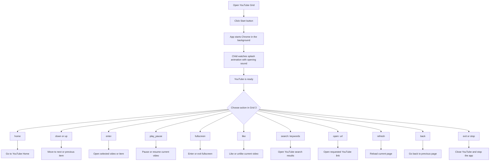

# Setup & Customization Guide (V7) — For Parents, Teachers, and Therapists

Hebrew version (RTL): [SETUP_V7_HE.md](SETUP_V7_HE.md)

This guide explains how to install, configure, and use the V7 YouTube accessibility system.

V7 replaces the old V6 script-based flow (`send.vbs`, `nav.exe`, `skip_ads.exe`) with a single app:
- `YouTubeControl.exe` in Leader mode (resident background)
- `YouTubeControl.exe <action>` in Messenger mode (quick relay)

---

## Prerequisites

Before installation, make sure the target computer has:

- Windows 10 or Windows 11
- Grid 3 installed and licensed
- Installer file: `Output\YouTube_V7_Full_Installer.exe`

Notes:
- The V7 installer includes a bundled Chrome Canary setup (`ChromeSetup.exe`).
- If Chrome Canary is missing, it is installed automatically during setup.

---

## Installation (V7)

1. Run `Output\YouTube_V7_Full_Installer.exe` as Administrator.
2. Follow the setup wizard.
3. The installer will:
   - Install app files into `C:\YouTube_Navigator_V7\`
   - Create user-data directory `C:\YouTube_User_Data`
   - Add Windows Defender exclusions for the app directory and the user-data directory
   - Add desktop/start-menu shortcuts for `YouTubeControl.exe`
   - Install Chrome Canary silently if not already installed
4. At the end of setup, a message is shown: first startup must be done by a teacher/therapist because manual sign-in is required.

---

## First Startup (Required Supervision)

On first startup:

1. Launch `C:\YouTube_Navigator_V7\YouTubeControl.exe` (no arguments).
2. Wait for Chrome to open.
3. Manually sign in to the user Chrome profile account.
4. Confirm YouTube opens correctly.
5. Close with:
   - `C:\YouTube_Navigator_V7\YouTubeControl.exe exit`

After this first supervised run, daily use is fully command-driven from Grid 3.

Important:
- `C:\YouTube_User_Data` is created on first install and keeps the signed-in session.
- On future updates, sign-in is usually not required again unless the profile folder was removed.
- After first sign-in, restart the computer once before regular daily use.

Safety recommendation:
- Use a supervised Google child account for the student (Google Family Link / parental controls).
- Parents/teachers/therapists should monitor accessible content regularly.

---

## Daily Use Model

### Leader startup (once)
When entering the YouTube grid set, start:

`C:\YouTube_Navigator_V7\YouTubeControl.exe`

This starts Leader mode and keeps the background controller running.

### Command relay (per button press)
Each Grid 3 command button should run:

`C:\YouTube_Navigator_V7\YouTubeControl.exe <action>`

This starts Messenger mode, relays one command to Leader, and exits immediately.

---

## Grid 3 Configuration (V7)

## Computer Control requirement

Use Grid 3 in Computer Control mode (Windows only).

## Grid open action
Configure "When this grid opens":

- Action type: Start Program (Computer Control)
- Program: `C:\YouTube_Navigator_V7\YouTubeControl.exe`
- Parameters: (empty)

## Command cell action
For each YouTube control cell:

- Action type: Run Program (Computer Control)
- Program: `C:\YouTube_Navigator_V7\YouTubeControl.exe`
- Parameters: action command (for example `down`, `home`, `search: disney songs`)

## Leave grid safely
For the Grid Explorer / Home cell:

1. Add command action first:
   - Program: `C:\YouTube_Navigator_V7\YouTubeControl.exe`
   - Parameters: `exit`
2. Keep existing "Jump to grid" action after it.

This ensures YouTubeControl and browser session close cleanly when leaving the YouTube grid.

For Grid 3 users:
- The `exit` action is already built into the "Back to Applications" button.
- If the child leaves the communication board using "Back to Applications", the app should close cleanly.

---

## Full V7 Command Reference (All Supported Commands)

| Command | Purpose | Example Grid Parameter |
|---|---|---|
| `home` | Go to YouTube home | `home` |
| `down` | Move selection down/next | `down` |
| `up` | Move selection up/previous | `up` |
| `enter` | Activate current selection | `enter` |
| `back` | Browser history back | `back` |
| `play_pause` | Toggle play/pause | `play_pause` |
| `fullscreen` | Toggle fullscreen | `fullscreen` |
| `like` | Toggle Like | `like` |
| `refresh` | Reload active YouTube page | `refresh` |
| `search: keywords` | Open YouTube search results | `search: disney songs` |
| `open: url` | Open direct URL | `open: https://www.youtube.com/shorts` |
| `exit` | Stop leader and close browser | `exit` |
| `stop` | Alias of `exit` | `stop` |

Notes:
- `stop` and `exit` are equivalent shutdown commands.
- `search:` and `open:` include text after `:`.

---

## User Action Flow (Grid 3)

If the red navigation frame does not appear, press one navigation key (`down` or `up`) once. The frame should appear and navigation can continue normally.

---

## Troubleshooting (V7)

| Problem | What to check |
|---|---|
| Chrome does not open | Start Leader manually: `C:\YouTube_Navigator_V7\YouTubeControl.exe` |
| Commands do nothing | Verify Leader is running first (no-args launch) |
| Grid cell command fails | Ensure Program is `YouTubeControl.exe` and Parameters contain only the command |
| First run fails for user | Perform supervised manual sign-in once (teacher/therapist) |
| Search/open command not working | Validate correct `search: keywords` or `open: url` format |
| Shutdown does not happen | Use `exit` or `stop` command explicitly |
| Chrome was closed manually with X and app no longer reopens Chrome | Close `YouTubeControl.exe` from Task Manager, then start again. If still stuck, restart the computer. |
| App does not start correctly after leaving the grid | End `YouTubeControl.exe` in Task Manager, then retry from Grid 3. If still stuck, restart the computer. |

---

## Migration Note

This file is the V7 setup guide. The old V6 setup flow with `send.vbs`, HTTP port `3000`, and `Setup_System.bat` is not used in the V7 runtime.
