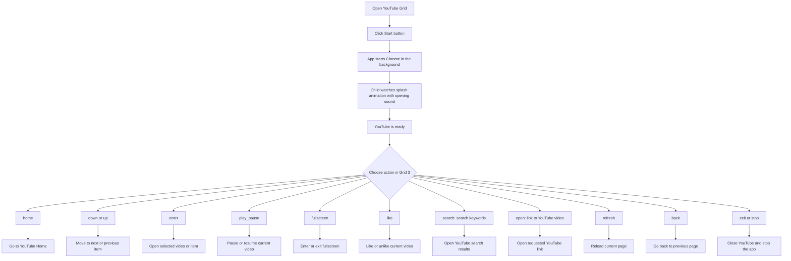

# Setup & Customization Guide (V7) - For Parents, Teachers, and Therapists

Hebrew version (RTL): [SETUP_V7_HE.md](SETUP_V7_HE.md)

This guide explains how to install and use the YouTube V7 Grid 3 add-on for computer. Technical details on how the system operates under the hood can be found in the main README.

*Users who wish to configure their own grid set manually can skip to [Manual Grid Set Configuration from scratch](#manual-grid-set-configuration-from-scratch). [[Link to community Grid sets for example (coming soon)]]*

---

## Prerequisites

Before installation, make sure the target computer has:

- Windows 10 or Windows 11
- Grid 3 installed and licensed
- **User's Google account details:** Email address, password, and access to the secondary verification method (e.g., phone access) if two-factor authentication (2FA) is enabled.
- Installer file: `Output\YouTube_V7_Full_Installer.exe` (Downloadable from [this link](https://github.com/ReneDva/Grid3-YouTube-Accessibility-Addon/releases/latest))

**Note:**
This add-on uses a specialized browser version called **Chrome Canary** (logo below). It will open YouTube in its WEB version, not through the standard desktop YouTube app or the regular Google Chrome.

---

## Installation (V7)

1. Run `Output\YouTube_V7_Full_Installer.exe` as Administrator.
2. **Security Alert:** Windows might alert you that the file is unknown. Click **"More info"** and then **"Run anyway"**.
3. Follow the setup wizard instructions.
4. **Completion:** Upon finishing the setup, a new **Chrome Canary** window will open automatically.
5. **Initial Sign-in:** You must sign in to the child's Google account in this window.
6. **Final Step:** After signing in successfully, **you must restart the computer** before daily use begins.

---

## Startup and Connection Fix

If you accidentally closed the Chrome Canary window before signing in:
1. Locate the desktop shortcut with the app icon:
   
2. Launch it manually. The Chrome Canary window will reappear.
3. Complete the sign-in, confirm YouTube is working, and then **restart the computer**.

Once this is done, the student can start the add-on directly from their Grid set.

---

## Safety recommendations
- If the user is a minor, it is highly recommended to set up the student's Google account as a supervised child account (using Google Family Link).
- Parents, teachers, and therapists should regularly monitor the content accessed.

---

## Safe Exit

The close action is built directly into the **"Back to Applications"** button in Grid 3. Using this button ensures that both the browser and the add-on close cleanly and quietly in the background. This applies to all users, whether using a pre-made grid set or a custom one.

## User Action Flow (Grid 3)

**Tip:** If the red navigation frame does not appear, press one navigation key (`down` or `up`) once. The frame should appear and navigation can continue normally.

---

## Troubleshooting (V7)

If you encounter issues (Chrome not opening, commands not responding, etc.):

1.  **Check individual cells:** If only one specific button isn't working, check its configuration. Ensure there are no typos in the parameters and that it points to the correct program.
2.  **General fix:** If multiple buttons fail or Chrome is behaving unexpectedly, the primary solution is to **restart the computer**. 
    *   *Technical note:* You can also try closing `YouTubeControl.exe` via the **Task Manager** and then relaunching from Grid 3, but for most users, a full restart is the simplest and most effective way to clear the background app state.

---

## Manual Grid Set Configuration from scratch

For users creating their own grid set (link to community grid sets to be provided later), you must configure cells to **Run Program** using the application path and the corresponding parameter from the list below.

### Grid Setup Tips
In the opening page of this Grid set, place a Start button and add the following actions:

- Action type: Start Program (Computer Control)
- Program: `C:\YouTube_Navigator_V7\YouTubeControl.exe`
- Parameters: (empty)

### Command Reference

| Command | Purpose | Example Parameter |
|---|---|---|
| `home` | Go to YouTube home | `home` |
| `down` | Move selection down | `down` |
| `up` | Move selection up | `up` |
| `enter` | Activate current selection | `enter` |
| `back` | Browser history back | `back` |
| `play_pause` | Toggle play/pause | `play_pause` |
| `fullscreen` | Toggle fullscreen | `fullscreen` |
| `like` | Toggle Like | `like` |
| `refresh` | Reload current page | `refresh` |
| `search:` | Open search results | `search: search keywords` |
| `open:` | Open direct URL | `open: link to YouTube video` |
| `exit` | Stop and close browser | `exit` |

### Manual Configuration Steps
For detailed technical instructions on how to set up individual cells manually, please refer to the "Grid 3 Configuration" section in the technical [README](../README.md).

---

## Migration Note

Please note: Grid sets that worked with V6 or earlier **will not work** with the current version. You must use the new grid set format.

---
