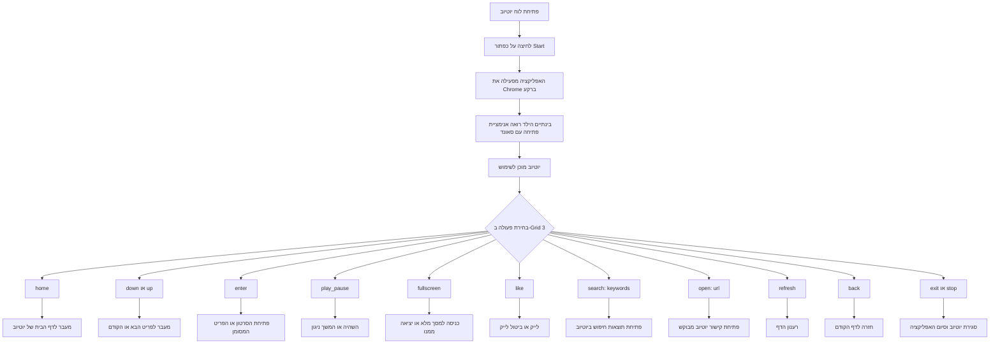

# מדריך התקנה והגדרה (V7) — להורים, מורים ומטפלים

מדריך זה מסביר כיצד להתקין, להגדיר ולהפעיל את מערכת הנגישות ליוטיוב בגרסה V7.

ב־V7 הוחלף תהליך V6 הישן שהתבסס על סקריפטים, באפליקציה אחת:
- YouTubeControl.exe במצב Leader (רץ ברקע)
- YouTubeControl.exe <action> במצב Messenger (שליחת פקודה מהירה)

---

## דרישות מוקדמות

לפני ההתקנה ודאו שקיימים:

- Windows 10 או Windows 11
- Grid 3 מותקן ומורשה
- קובץ התקנה: Output\YouTube_V7_Full_Installer.exe

הערות:
- מתקין V7 כולל התקנה של Chrome Canary (ChromeSetup.exe).
- אם Chrome Canary לא מותקן, ההתקנה תבצע זאת אוטומטית.

---

## התקנה (V7)

1. הפעילו את Output\YouTube_V7_Full_Installer.exe כמנהל מערכת.
2. המשיכו לפי אשף ההתקנה.
3. המתקין יבצע:
   - התקנת קבצים לתיקיה C:\YouTube_Navigator_V7\
   - יצירת תיקיית נתוני משתמש C:\YouTube_User_Data
   - הוספת חריגים ל־Windows Defender עבור תיקיית האפליקציה ותיקיית נתוני המשתמש
   - יצירת קיצורי דרך לשולחן העבודה ולתפריט התחל עבור YouTubeControl.exe
   - התקנה שקטה של Chrome Canary אם אינו מותקן
4. בסוף ההתקנה תוצג הודעה: הפעלה ראשונה חייבת להתבצע על ידי מורה/מטפל, כי נדרשת התחברות ידנית.

---

## הפעלה ראשונה (בליווי מבוגר)

בהפעלה הראשונה:

1. הפעילו את C:\YouTube_Navigator_V7\YouTubeControl.exe ללא פרמטרים.
2. המתינו לפתיחת Chrome.
3. התחברו ידנית לחשבון Google של המשתמש.
4. ודאו שיוטיוב נפתח ועובד תקין.
5. סגרו בצורה מסודרת באמצעות:
   - C:\YouTube_Navigator_V7\YouTubeControl.exe exit

לאחר הרצה ראשונה זו, השימוש היומיומי מתבצע דרך Grid 3 בלבד.

חשוב:
- התיקיה C:\YouTube_User_Data נוצרת בהתקנה ראשונה ושומרת את פרטי ההתחברות.
- בעדכונים הבאים לרוב לא תידרש התחברות מחדש, אלא אם התיקיה נמחקה.
- לאחר ההתחברות הראשונה מומלץ להפעיל מחדש את המחשב פעם אחת לפני שימוש קבוע.

המלצת בטיחות:
- מומלץ להגדיר לילד חשבון ילד מפוקח ב־Google (למשל Family Link).
- הורים/מורים/מטפלים צריכים לנטר את סוג התכנים שהילד נחשף אליהם.

---

## מודל שימוש יומיומי

### הפעלת Leader (פעם אחת)
בעת כניסה ללוח יוטיוב, הפעילו:

C:\YouTube_Navigator_V7\YouTubeControl.exe

כך מופעל מצב Leader שנשאר פעיל ברקע.

### שליחת פקודה (בכל לחיצה)
כל כפתור פקודה ב־Grid 3 צריך להריץ:

C:\YouTube_Navigator_V7\YouTubeControl.exe <action>

כך מופעל מצב Messenger ששולח פקודה אחת ל־Leader ונסגר מיד.

---

## הגדרות Grid 3 (V7)

## דרישת Computer Control

יש להשתמש ב־Grid 3 במצב Computer Control (ב־Windows).

## פעולה בפתיחת הלוח

בהגדרה "When this grid opens":

- Action type: Start Program (Computer Control)
- Program: C:\YouTube_Navigator_V7\YouTubeControl.exe
- Parameters: ריק

## פעולה בכל תא פקודה

בכל תא פקודה של יוטיוב:

- Action type: Run Program (Computer Control)
- Program: C:\YouTube_Navigator_V7\YouTubeControl.exe
- Parameters: פקודה מתאימה, לדוגמה down, home, search: disney songs

## יציאה בטוחה מהלוח

עבור כפתור "חזור למסך יישומים":

1. הוסיפו קודם פעולת פקודה:
   - Program: C:\YouTube_Navigator_V7\YouTubeControl.exe
   - Parameters: exit
2. השאירו אחריה את פעולת "Jump to grid" הקיימת.

כך האפליקציה והדפדפן נסגרים בצורה תקינה ביציאה מלוח יוטיוב.

למשתמשי Grid 3:
- פעולת exit כבר מובנית בכפתור "חזור למסך יישומים".
- כאשר הילד יוצא דרך "חזור למסך יישומים", האפליקציה אמורה להיסגר באופן תקין.

---

## רשימת פקודות מלאה (V7)

| פקודה | מטרה | דוגמת פרמטר |
|---|---|---|
| home | מעבר לדף הבית של יוטיוב | home |
| down | מעבר לפריט הבא | down |
| up | מעבר לפריט הקודם | up |
| enter | בחירת הפריט המסומן | enter |
| back | חזרה לעמוד הקודם בדפדפן | back |
| play_pause | ניגון/השהיה | play_pause |
| fullscreen | מעבר למסך מלא / יציאה ממסך מלא | fullscreen |
| like | לייק/ביטול לייק | like |
| refresh | רענון הדף הפעיל | refresh |
| search: keywords | פתיחת תוצאות חיפוש ביוטיוב | search: disney songs |
| open: url | פתיחת קישור ישיר | open: https://www.youtube.com/shorts |
| exit | סגירת הדפדפן וה־Leader | exit |
| stop | זהה ל־exit | stop |

הערות:
- stop ו־exit הן פקודות שקולות לסיום.
- search: ו־open: מקבלות טקסט לאחר הנקודתיים.

---

## תרשים זרימת פעולות משתמש (Grid 3)

אם מסגרת הניווט האדומה לא מופיעה, לחצו פעם אחת על מקש ניווט (down או up). המסגרת תופיע וניתן יהיה להמשיך לנווט כרגיל.

---

## פתרון תקלות (V7)

| תקלה | מה לבדוק |
|---|---|
| Chrome לא נפתח | להפעיל ידנית: C:\YouTube_Navigator_V7\YouTubeControl.exe |
| פקודות לא עובדות | לוודא ש־Leader כבר פועל (הרצה ללא פרמטרים) |
| תא פקודה ב־Grid 3 לא עובד | לוודא Program = YouTubeControl.exe ושה־Parameters מכיל רק את הפקודה |
| הפעלה ראשונה נכשלה | לבצע התחברות ידנית בליווי מורה/מטפל |
| search/open לא עובד | לוודא פורמט תקין: search: keywords או open: url |
| כיבוי לא מתבצע | להשתמש ב־exit או stop |
| סגרו את Chrome ידנית (X) והוא לא נפתח שוב | לסגור YouTubeControl.exe דרך Task Manager ולהפעיל מחדש; אם לא מסתדר, להפעיל מחדש את המחשב |
| האפליקציה לא נפתחת תקין אחרי יציאה מהלוח | לסיים YouTubeControl.exe דרך Task Manager ולנסות שוב מ־Grid 3; אם לא מסתדר, להפעיל מחדש את המחשב |

---

## הערת מעבר מגרסה קודמת

קובץ זה הוא מדריך V7. תהליך V6 הישן עם send.vbs, שרת HTTP על פורט 3000 ו־Setup_System.bat אינו חלק מהריצה ב־V7.

