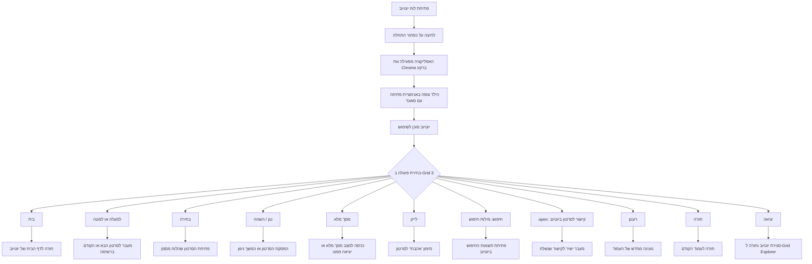



# מדריך התקנה והגדרה (V7) - להורים, מורים ומטפלים

מדריך זה מסביר כיצד להתקין ולהשתמש בתוסף ליוטיוב עבור Grid 3 למחשב (גרסה V7). פרטים טכניים על אופן פעולת המערכת מאחורי הקלעים נמצאים בתיעוד ה-README הראשי.

*משתמשים שרוצים להגדיר לוח באופן עצמאי יכולים לדלג ל-[הגדרת לוח מ-0 באופן עצמאי](#הגדרת-לוח-מ-0-באופן-עצמאי). [קישור לאתר הקהילה להורדת לוח לדוגמה (בקרוב)]*

---

## דרישות מוקדמות

לפני ההתקנה ודאו שקיימים:

- מחשב עם Windows 10 או Windows 11.
- תוכנת Grid 3 מותקנת ומורשית.
- **פרטי החשבון של המשתמש:** כתובת מייל, סיסמה וגישה לאמצעי אימות נוסף (כגון טלפון) אם מוגדר אימות דו-שלבי (2FA).
- קובץ התקנה: `Output\YouTube_V7_Full_Installer.exe` (ניתן להורדה מ-[קישור זה](https://github.com/ReneDva/Grid3-YouTube-Accessibility-Addon/releases/latest)).

**שימו לב:**
התוסף משתמש בגרסה מיוחדת של דפדפן בשם **Chrome Canary** (הלוגו שלו מופיע מטה). יוטיוב ייפתח בגרסת ה-WEB שלו בתוך דפדפן זה, ולא דרך אפליקציית יוטיוב הרגילה למחשב או דפדפן כרום הרגיל.

---

## התקנה (V7)

1. הפעילו את קובץ ההתקנה Output\YouTube_V7_Full_Installer.exe כמנהל מערכת (Administrator).
2. **התראת אבטחה:** ייתכן ו-Windows תציג הודעה שהקובץ אינו מוכר. במקרה כזה, לחצו על **"מידע נוסף" (More info)** ואז על **"הפעל בכל זאת" (Run anyway)**.
3. עקבו אחר הוראות אשף ההתקנה עד לסיומו.
4. **בסיום ההתקנה:** ייפתח באופן אוטומטי חלון חדש של **Chrome Canary**.
5. **התחברות ראשונית:** עליכם לבצע התחברות לחשבון ה-Google של הילד בתוך החלון שנפתח.
6. **שלב אחרון:** לאחר התחברות מוצלחת, **חובה לבצע הפעלה מחדש (Restart) למחשב** לפני תחילת השימוש היומיומי.

---

## התחברות בהפעלה ראשונית

אם סגרתם בטעות את חלון ה-Chrome Canary לפני שביצעתם התחברות:
1. חפשו בשולחן העבודה את קיצור הדרך עם האייקון של האפליקציה:
   
2. הפעילו אותו ידנית. חלון ה-Chrome Canary ייפתח שוב.
3. השלימו את ההתחברות, ודאו שיוטיוב עובד, ולאחר מכן **בצעו הפעלה מחדש למחשב**.

לאחר מכן, התלמיד יוכל להפעיל את התוסף ישירות מתוך ה-Grid set שלו.

---

## המלצות בטיחות
- במידה ומדובר במשתמש צעיר, מומלץ מאוד להגדיר את חשבון ה-Google שלו כחשבון ילד מפוקח (באמצעות Google Family Link).
- הורים, מורים ומטפלים צריכים לנטר באופן קבוע את התכנים שהתלמיד ניגש אליהם.

---

## יציאה בטוחה

פעולת הסגירה מובנית ישירות בתוך כפתור **"חזור למסך יישומים"** ב-Grid 3. שימוש בכפתור זה מבטיח שהדפדפן והתוסף ייסגרו בצורה נקייה ושקטה ברקע. הנחיה זו תקפה לכולם, בין אם אתם משתמשים בלוח מוכן מראש ובין אם בלוח שיצרתם בעצמכם.

---

## תרשים זרימת פעולות משתמש (Grid 3)

**טיפ:** אם מסגרת הניווט האדומה לא מופיעה על המסך, לחצו פעם אחת על כפתור ניווט (למעלה או למטה). המסגרת תופיע ותאפשר להתחיל לבחור סרטונים.

---

## פתרון תקלות (V7)

אם נתקלתם בבעיות (Chrome לא נפתח, פקודות לא מגיבות וכדומה):

1.  **בדיקת תאים בודדים:** אם רק תא מסוים לא עובד, בדקו את הגדרת הפעולה בו. ודאו שאין שגיאות כתיב בפרמטרים ושהתא מפעיל את התוכנה הנכונה.
2.  **פתרון כללי:** אם הבעיה כוללת יותר מתא אחד או שהדף מתנהג בצורה מוזרה, הפתרון העיקרי הוא **לבצע הפעלה מחדש למחשב**.
    *   *הערה טכנית:* ניתן גם לנסות לסגור את `YouTubeControl.exe` דרך **מנהל המשימות (Task Manager)** ולהפעיל מחדש מהגריד, אך עבור רוב המשתמשים, הפעלה מחדש של המחשב היא הדרך הפשוטה והיעילה ביותר לאפס את מצב התוכנה שרצה ברקע (במיוחד כשכפתור ה-X של הדפדפן אינו סוגר את התוסף).

---

## הגדרת לוח מ-0 באופן עצמאי

עבור משתמשים היוצרים לוח (Grid set) משלהם, עליכם להגדיר בתאים את פעולת **Run Program** עם נתיב האפליקציה והפרמטר המתאים מהרשימה מטה.

### טיפים להגדרת הלוח
בלוח פתיחה של היישום גריד הזה שימו כפתור הפעל ובו תוסיפו את הפעולות:

- סוג פעולה: Start Program (Computer Control)
- תוכנה: `C:\YouTube_Navigator_V7\YouTubeControl.exe`
- פרמטרים: (ריק)

### רשימת פקודות

| פקודה | מטרה | דוגמת פרמטר (באנגלית) |
|---|---|:---|
| home | מעבר לדף הבית | home |
| down | מעבר לסרטון הבא | down |
| up | מעבר לסרטון הקודם | up |
| enter | בחירה/כניסה | enter |
| back | חזרה | back |
| play_pause | נגן/השהה | play_pause |
| fullscreen | מסך מלא | fullscreen |
| like | לייק | like |
| refresh | רענון דף | refresh |
| search: | חיפוש | מילות חיפוש :search  |
| open: | קישור ישיר | קישור לסרטון ביוטיוב :open|
| exit | סגירת התוסף | exit |

### שלבי הגדרה ידנית
להוראות טכניות מפורטות על אופן הגדרת תאים בודדים באופן ידני, אנא עיינו בסעיף "Grid 3 Configuration" בתיעוד ה-README הטכני.

---

## הערת מעבר מגרסה קודמת

שימו לב: לוחות תקשורת (Grid sets) שעבדו בגרסאות קודמות **לא יעבדו כלל** בגרסה הנוכחית, ולכן נדרש להשתמש בפורמט של הלוח החדש בלבד.

---

