<div dir="rtl" lang="he" style="direction:rtl; text-align:right;">


# מדריך התקנה והגדרה (V7) - להורים, מורים ומטפלים

מדריך זה מסביר כיצד להתקין ולהשתמש בתוסף ליוטיוב עבור Grid 3 למחשב (גרסה V7). פרטים טכניים על אופן פעולת המערכת מאחורי הקלעים נמצאים בתיעוד ה-README הראשי.

*משתמשים שרוצים להגדיר לוח באופן עצמאי יכולים לדלג ל-[הגדרת לוח מ-0 באופן עצמאי](#הגדרת-לוח-מ-0-באופן-עצמאי). [קישור לאתר הקהילה להורדת לוח לדוגמה (בקרוב)]*

---

## דרישות מוקדמות

לפני ההתקנה ודאו שקיימים:

- מחשב עם Windows 10 או Windows 11.
- תוכנת Grid 3 מותקנת ומורשית.
- **פרטי החשבון של המשתמש:** כתובת מייל, סיסמה וגישה לאמצעי אימות נוסף (כגון טלפון) אם מוגדר אימות דו-שלבי (2FA).
- קובץ התקנה: `Output\YouTube_V7_Full_Installer.exe` (ניתן להורדה מ-[קישור זה](https://github.com/ReneDva/Grid3-YouTube-Accessibility-Addon/releases/latest)).

**שימו לב:**
התוסף משתמש בגרסה מיוחדת של דפדפן בשם **Chrome Canary** (הלוגו שלו מופיע מטה). יוטיוב ייפתח בגרסת ה-WEB שלו בתוך דפדפן זה, ולא דרך אפליקציית יוטיוב הרגילה למחשב או דפדפן כרום הרגיל.


---

## התקנה (V7)

1. הפעילו את קובץ ההתקנה Output\YouTube_V7_Full_Installer.exe כמנהל מערכת (Administrator).
2. **התראת אבטחה:** ייתכן ו-Windows תציג הודעה שהקובץ אינו מוכר. במקרה כזה, לחצו על **"מידע נוסף" (More info)** ואז על **"הפעל בכל זאת" (Run anyway)**.
3. עקבו אחר הוראות אשף ההתקנה עד לסיומו.
4. **בסיום ההתקנה:** ייפתח באופן אוטומטי חלון חדש של **Chrome Canary**.
5. **התחברות ראשונית:** עליכם לבצע התחברות לחשבון ה-Google של הילד בתוך החלון שנפתח.
6. **שלב אחרון:** לאחר התחברות מוצלחת, **חובה לבצע הפעלה מחדש (Restart) למחשב** לפני תחילת השימוש היומיומי.

---

## התחברות בהפעלה ראשונית

אם סגרתם בטעות את חלון ה-Chrome Canary לפני שביצעתם התחברות:
1. חפשו בשולחן העבודה את קיצור הדרך עם האייקון של האפליקציה:
   
2. הפעילו אותו ידנית. חלון ה-Chrome Canary ייפתח שוב.
3. השלימו את ההתחברות, ודאו שיוטיוב עובד, ולאחר מכן **בצעו הפעלה מחדש למחשב**.

לאחר מכן, התלמיד יוכל להפעיל את התוסף ישירות מתוך ה-Grid set שלו.

---

## המלצות בטיחות
- במידה ומדובר במשתמש צעיר, מומלץ מאוד להגדיר את חשבון ה-Google שלו כחשבון ילד מפוקח (באמצעות Google Family Link).
- הורים, מורים ומטפלים צריכים לנטר באופן קבוע את התכנים שהתלמיד ניגש אליהם.

---

## יציאה בטוחה

פעולת הסגירה מובנית ישירות בתוך כפתור **"חזור למסך יישומים"** ב-Grid 3. שימוש בכפתור זה מבטיח שהדפדפן והתוסף ייסגרו בצורה נקייה ושקטה ברקע. הנחיה זו תקפה לכולם, בין אם אתם משתמשים בלוח מוכן מראש ובין אם בלוח שיצרתם בעצמכם.

---

## תרשים זרימת פעולות משתמש (Grid 3)

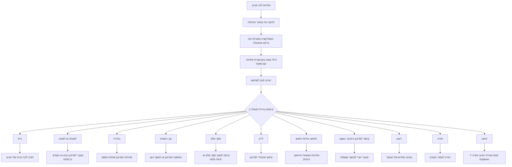

**טיפ:** אם מסגרת הניווט האדומה לא מופיעה על המסך, לחצו פעם אחת על כפתור ניווט (למעלה או למטה). המסגרת תופיע ותאפשר להתחיל לבחור סרטונים.

---

## פתרון תקלות (V7)

אם נתקלתם בבעיות (Chrome לא נפתח, פקודות לא מגיבות וכדומה):

1.  **בדיקת תאים בודדים:** אם רק תא מסוים לא עובד, בדקו את הגדרת הפעולה בו. ודאו שאין שגיאות כתיב בפרמטרים ושהתא מפעיל את התוכנה הנכונה.
2.  **פתרון כללי:** אם הבעיה כוללת יותר מתא אחד או שהדף מתנהג בצורה מוזרה, הפתרון העיקרי הוא **לבצע הפעלה מחדש למחשב**.
    *   *הערה טכנית:* ניתן גם לנסות לסגור את `YouTubeControl.exe` דרך **מנהל המשימות (Task Manager)** ולהפעיל מחדש מהגריד, אך עבור רוב המשתמשים, הפעלה מחדש של המחשב היא הדרך הפשוטה והיעילה ביותר לאפס את מצב התוכנה שרצה ברקע (במיוחד כשכפתור ה-X של הדפדפן אינו סוגר את התוסף).

---

## הגדרת לוח מ-0 באופן עצמאי

עבור משתמשים היוצרים לוח (Grid set) משלהם, עליכם להגדיר בתאים את פעולת **Run Program** עם נתיב האפליקציה והפרמטר המתאים מהרשימה מטה.

---

### שלב 1 — הפעלת מצב Computer Control

ודאו ש-Grid 3 פועל במצב **Computer Control**.

<p align="center">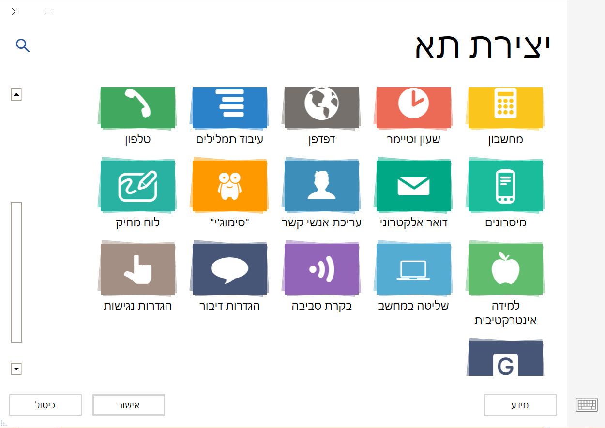</p>

---

### שלב 2 — כך נראה הלוח

<p align="center">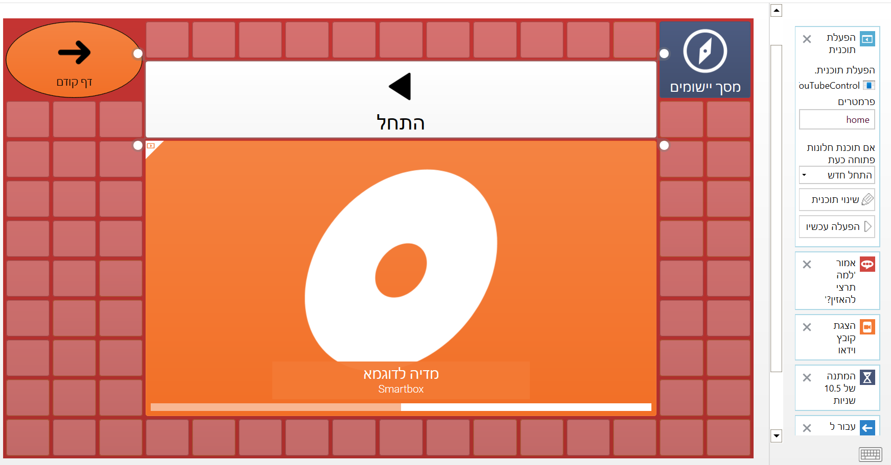</p>

תצוגת פקודות מלאה ומכווצת:

<table dir="rtl" style="margin:0 auto; border-collapse:collapse; white-space:nowrap;">
   <tr>
      <td style="text-align:center; vertical-align:top; padding:8px;">
         <div style="display:flex; flex-direction:column; align-items:center; justify-content:flex-start;">
            <strong style="display:block; margin-bottom:6px;">תצוגת פקודות מלאה:</strong>
            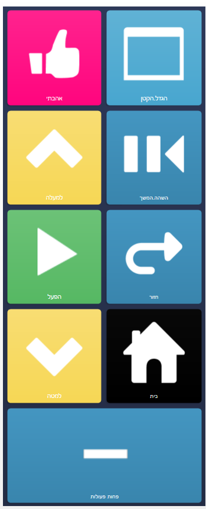
         </div>
      </td>
      <td style="text-align:center; vertical-align:top; padding:8px;">
         <div style="display:flex; flex-direction:column; align-items:center; justify-content:flex-start;">
            <strong style="display:block; margin-bottom:6px;">תצוגה מכווצת:</strong>
            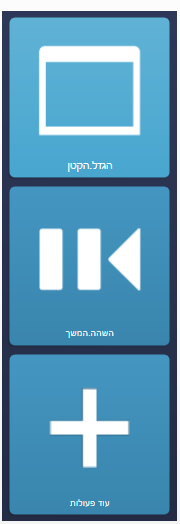
         </div>
      </td>
   </tr>
</table>

הצגת פקודות נוספות / פחות:

<table dir="rtl" style="margin:0 auto; border-collapse:collapse; white-space:nowrap;">
   <tr>
      <td style="text-align:center; vertical-align:top; padding:8px;">
         <div style="display:flex; flex-direction:column; align-items:center; justify-content:flex-start;">
            <strong style="display:block; margin-bottom:6px;">הצגת פקודות נוספות</strong>
            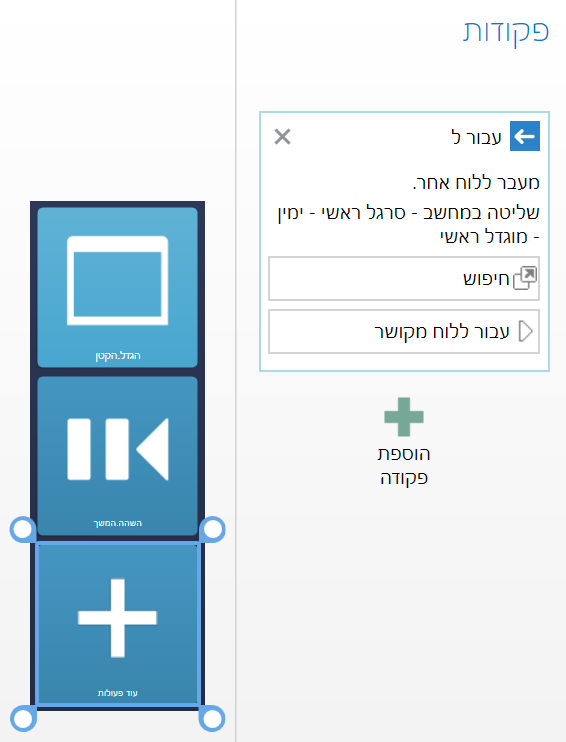
         </div>
      </td>
      <td style="text-align:center; vertical-align:top; padding:8px;">
         <div style="display:flex; flex-direction:column; align-items:center; justify-content:flex-start;">
            <strong style="display:block; margin-bottom:6px;">הצגת פקודות מופחתות</strong>
            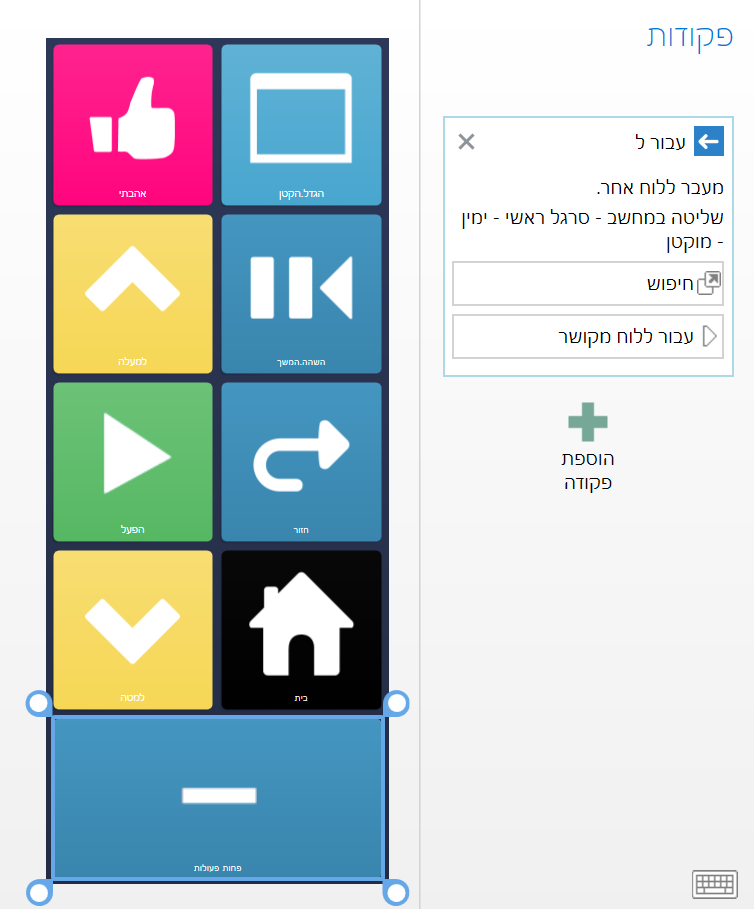
         </div>
      </td>
   </tr>
</table>

---

### שלב 3 — הגדרת פעולת פתיחת הלוח

בלוח הפתיחה, בצעו את השלבים הבאים:

<ol style="direction:rtl; padding-inline-start:1.2em;">
   <li style="margin-bottom:18px; display:block; width:100%;">
      <div style="display:flex; flex-direction:column; align-items:center; justify-content:flex-start;">
        <strong style="display:block; margin-bottom:8px;">3.1 — הוספת הפעולה: Start Program</strong>
        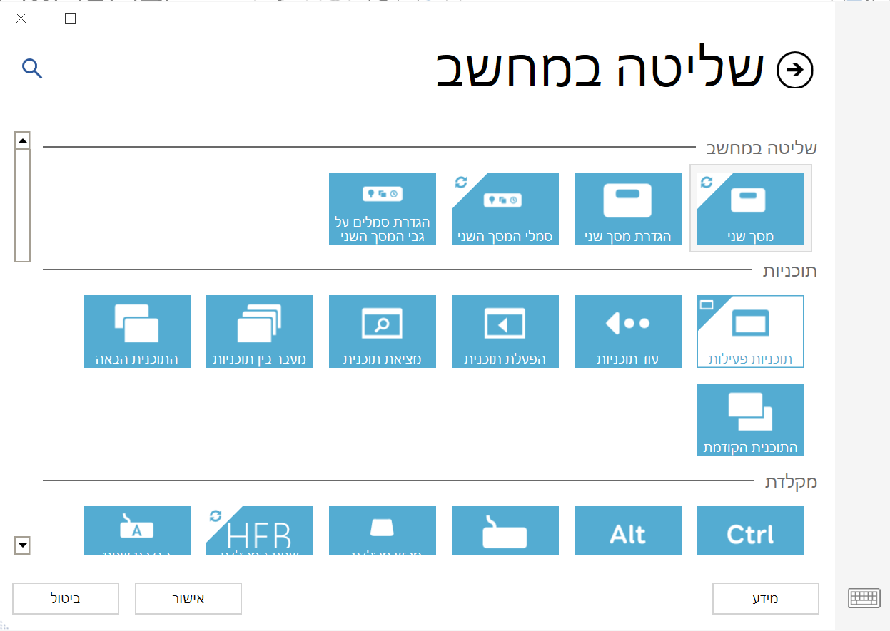
      </div>
   </li>
   <li style="margin-bottom:18px; display:inline-block; width:48%; vertical-align:top; text-align:center;">
      <div style="display:flex; flex-direction:column; align-items:center; justify-content:flex-start;">
        <strong style="display:block; margin-bottom:8px;">3.2 — בחירת קובץ התוכנה</strong>
        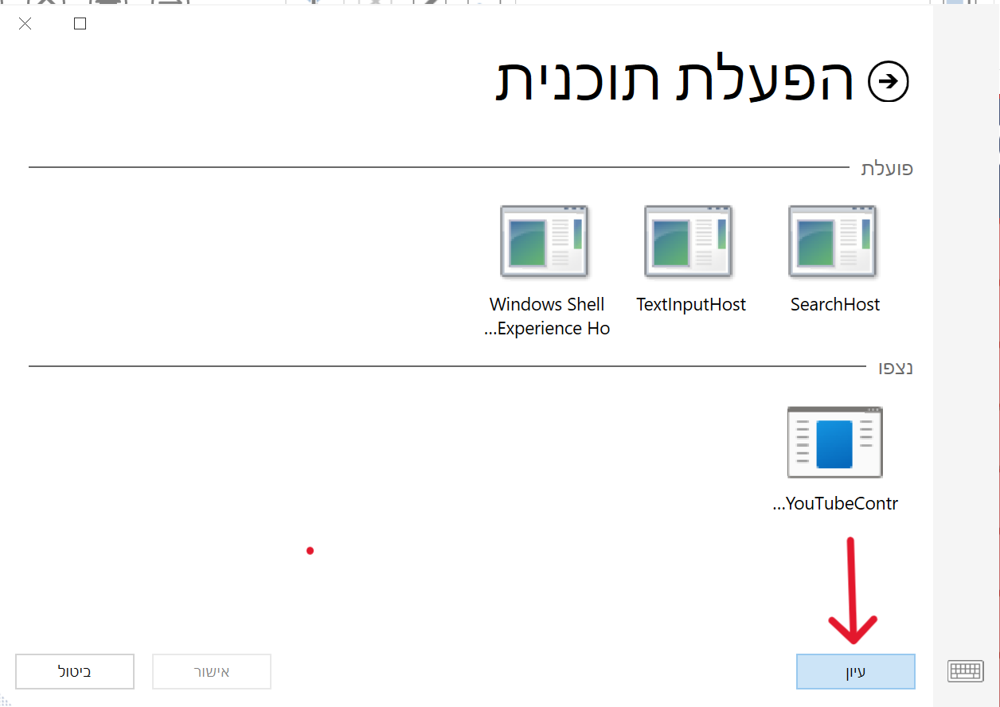
      </div>
   </li>
   <li style="margin-bottom:18px; display:inline-block; width:48%; vertical-align:top; text-align:center;">
      <div style="display:flex; flex-direction:column; align-items:center; justify-content:flex-start;">
        <strong style="display:block; margin-bottom:8px;">3.3 — קביעת מיקום התוכנה במחשב</strong>
        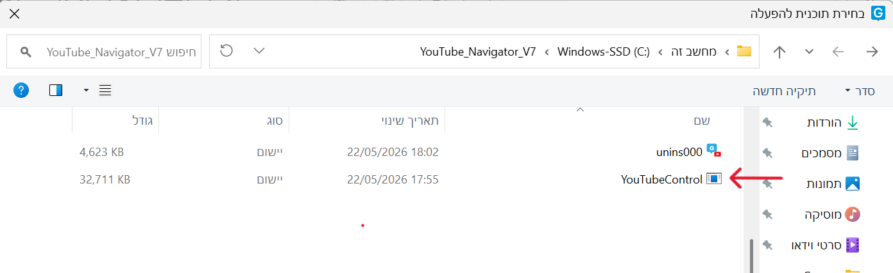
      </div>
   </li>
</ol>
<div dir="ltr" lang="en" style="direction:ltr; text-align:left;">
```
Program:    C:\YouTube_Navigator_V7\YouTubeControl.exe
Parameters: (ריק — ללא פרמטרים)
```
</div>
---

### שלב 4 — הגדרת תאי פקודה
לכל כפתור פעולה, הגדירו **Start Program** עם הפרמטר המתאים:
---

<div style="display:flex; gap:20px; align-items:flex-start; justify-content:center; margin-top:12px;">
   <div style="flex:0 0 auto; text-align:center; margin-left:12px;">
      <div style="display:flex; flex-direction:column; align-items:center; justify-content:flex-start;">
         <strong style="display:block; margin-bottom:8px;">הגדרת פקודה עם פרמטרים</strong>
         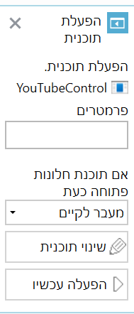
      </div>
   </div>

   <div style="flex:1 1 960px; max-width:1350px; direction:rtl; text-align:right;">
      <h3>רשימת כל הפקודות</h3>
      <table style="border-collapse:collapse; width:100%;">
         <thead>
            <tr>
               <th style="border-bottom:1px solid #ccc; padding:6px 8px; text-align:right;">פקודה</th>
               <th style="border-bottom:1px solid #ccc; padding:6px 8px; text-align:right;">מטרה</th>
               <th style="border-bottom:1px solid #ccc; padding:6px 8px; text-align:right;">פרמטר</th>
            </tr>
         </thead>
         <tbody>
            <tr>
               <td style="padding:6px 8px; text-align:right;">`home`</td>
               <td style="padding:6px 8px;">מעבר לדף הבית</td>
               <td style="padding:6px 8px; text-align:left ">home</td>
            </tr>
            <tr>
               <td style="padding:6px 8px; text-align:right">`down`</td>
               <td style="padding:6px 8px;">מעבר לסרטון הבא</td>
               <td style="padding:6px 8px; text-align:left;">down</td>
            </tr>
            <tr>
               <td style="padding:6px 8px; text-align:right">`up`</td>
               <td style="padding:6px 8px;">מעבר לסרטון הקודם</td>
               <td style="padding:6px 8px; text-align:left;">up</td>
            </tr>
            <tr>
               <td style="padding:6px 8px; text-align:right;">`enter`</td>
               <td style="padding:6px 8px;">בחירה/כניסה</td>
               <td style="padding:6px 8px;text-align:left;">enter</td>
            </tr>
            <tr>
               <td style="padding:6px 8px; text-align:right;">`back`</td>
               <td style="padding:6px 8px;">חזרה</td>
               <td style="padding:6px 8px;text-align:left;">back</td>
            </tr>
            <tr>
               <td style="padding:6px 8px; text-align:right;">`play_pause`</td>
               <td style="padding:6px 8px;">נגן/השהה</td>
               <td style="padding:6px 8px; text-align:left;">play_pause</td>
            </tr>
            <tr>
               <td style="padding:6px 8px; text-align:right;">`fullscreen`</td>
               <td style="padding:6px 8px;">מסך מלא</td>
               <td style="padding:6px 8px; text-align:left;">fullscreen</td>
            </tr>
            <tr>
               <td style="padding:6px 8px; text-align:right;">`like`</td>
               <td style="padding:6px 8px;">לייק</td>
               <td style="padding:6px 8px; text-align:left;">like</td>
            </tr>
            <tr>
               <td style="padding:6px 8px; text-align:right;">`refresh`</td>
               <td style="padding:6px 8px;">רענון דף</td>
               <td style="padding:6px 8px; text-align:left;">refresh</td>
            </tr>
            <tr>
               <td style="padding:6px 8px; text-align:right">`search:`</td>
               <td style="padding:6px 8px;">חיפוש</td>
               <td style="padding:6px 8px; text-align:left;">שירי ילדים :search</td>
            </tr>
            <tr>
               <td style="padding:6px 8px; text-align:right">`open:`</td>
               <td style="padding:6px 8px;">קישור ישיר</td>
               <td style="padding:6px 8px; text-align:left;">קישור לסרטון :open</td>
            </tr>
            <tr>
               <td style="padding:6px 8px; text-align:right;">`exit`</td>
               <td style="padding:6px 8px;">סגירת התוסף</td>
               <td style="padding:6px 8px; text-align:left;">exit</td>
            </tr>
         </tbody>
      </table>
   </div>

</div>

---

<!-- Responsive grid of actions (order: Open URL, Search, Up, Enter, Fullscreen, Like, Exit) -->
<div style="display:flex; flex-wrap:wrap; gap:18px; justify-content:center; direction:rtl; margin-top:12px;">
   <div style="flex:0 1 330px; max-width:390px; text-align:center;">
      <strong>פתיחת קישור — Open URL</strong>
      <div style="margin-top:8px;">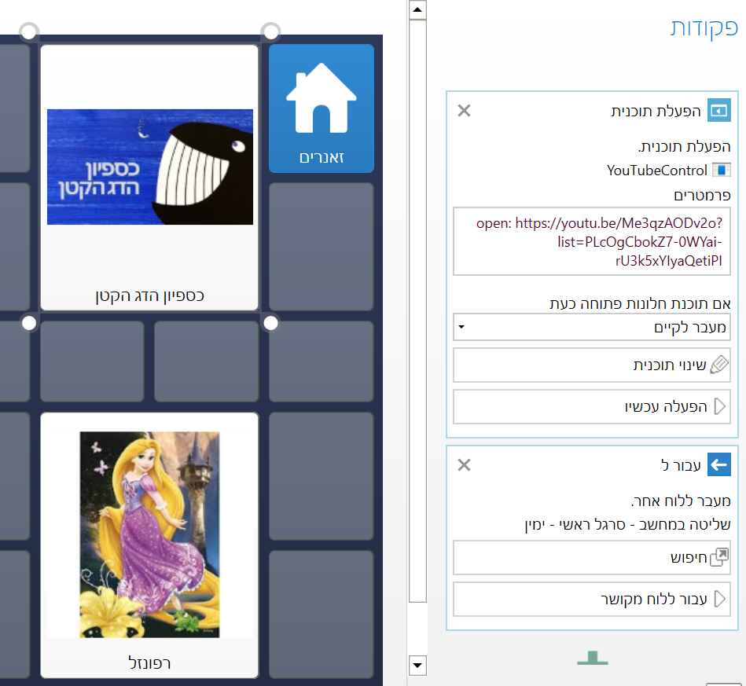</div>
      <div style="font-size:0.95em; color:#333; margin-top:6px;">פרמטר: <code>קישור לסרטון :open</code></div>
   </div>

   <div style="flex:0 1 330px; max-width:390px; text-align:center;">
      <strong>Search — חיפוש</strong>
      <div style="margin-top:8px;">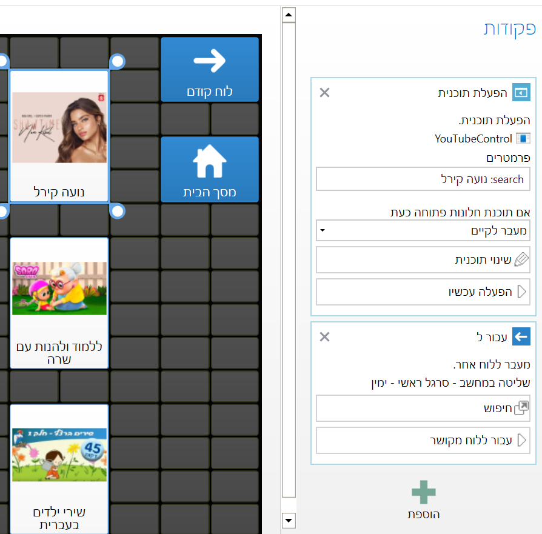</div>
      <div style="font-size:0.95em; color:#333; margin-top:6px;">פרמטר: <code>מילות חיפוש :search</code></div>
   </div>

   <div style="flex:0 1 330px; max-width:390px; text-align:center;">
      <strong>Up — ניווט למעלה</strong>
      <div style="margin-top:8px;">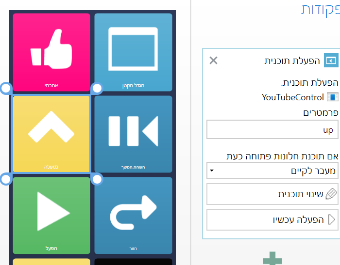</div>
      <div style="font-size:0.95em; color:#333; margin-top:6px;">פרמטר: <code>up</code></div>
   </div>

   <div style="flex:0 1 330px; max-width:390px; text-align:center;">
      <strong>Enter — בחירה / הפעלה</strong>
      <div style="margin-top:8px;">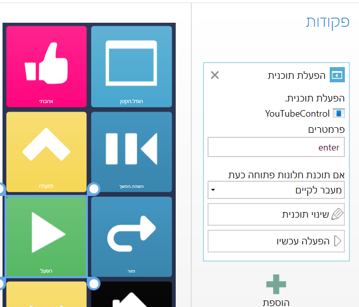</div>
      <div style="font-size:0.95em; color:#333; margin-top:6px;">פרמטר: <code>enter</code></div>
   </div>

   <div style="flex:0 1 330px; max-width:390px; text-align:center;">
      <strong>Fullscreen — מסך מלא</strong>
      <div style="margin-top:8px;">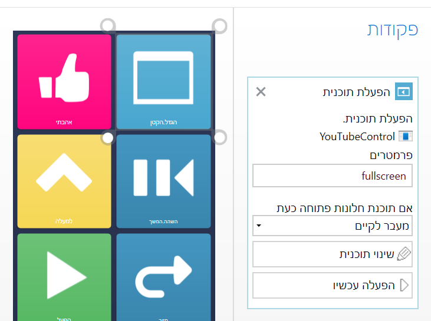</div>
      <div style="font-size:0.95em; color:#333; margin-top:6px;">פרמטר: <code>fullscreen</code></div>
   </div>

   <div style="flex:0 1 330px; max-width:390px; text-align:center;">
      <strong>Like — לייק</strong>
      <div style="margin-top:8px;">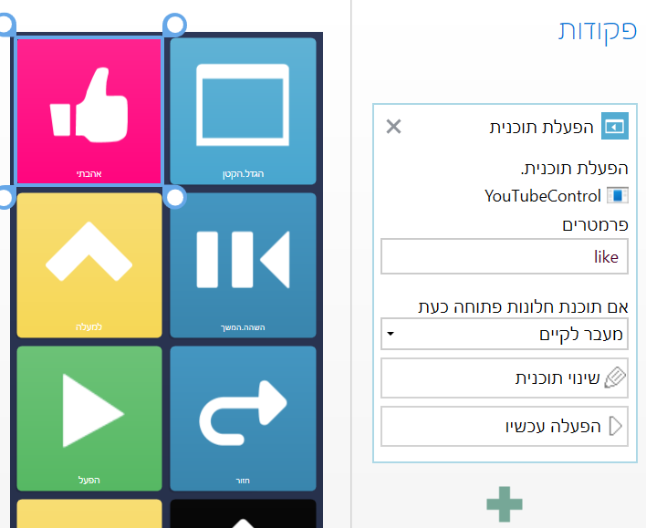</div>
      <div style="font-size:0.95em; color:#333; margin-top:6px;">פרמטר: <code>like</code></div>
   </div>

   <div style="flex:0 1 330px; max-width:390px; text-align:center;">
      <strong>Exit — יציאה וסגירה</strong>
      <div style="margin-top:8px;">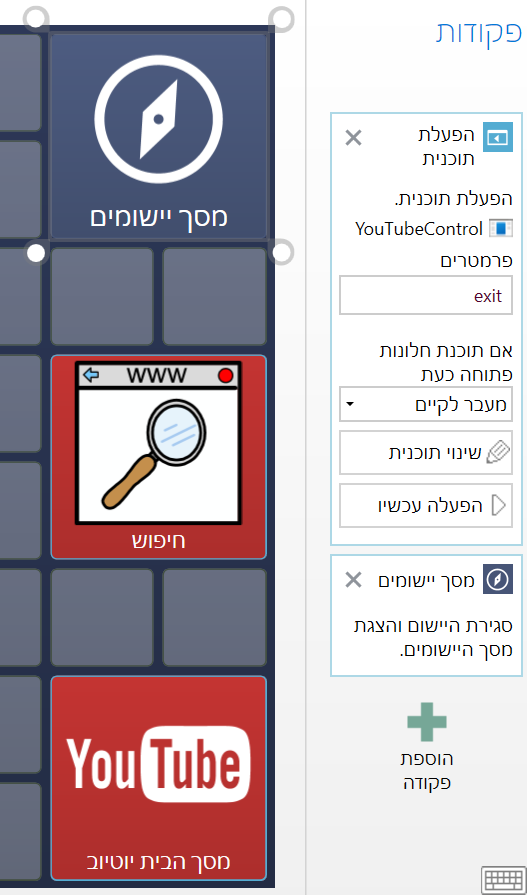</div>
      <div style="font-size:0.95em; color:#333; margin-top:6px;">פרמטר: <code>exit</code></div>
   </div>

</div>

---
## הערת מעבר מגרסה קודמת

שימו לב: לוחות תקשורת (Grid sets) שעבדו בגרסאות קודמות **לא יעבדו כלל** בגרסה הנוכחית, ולכן נדרש להשתמש בפורמט של הלוח החדש בלבד.


</div>

