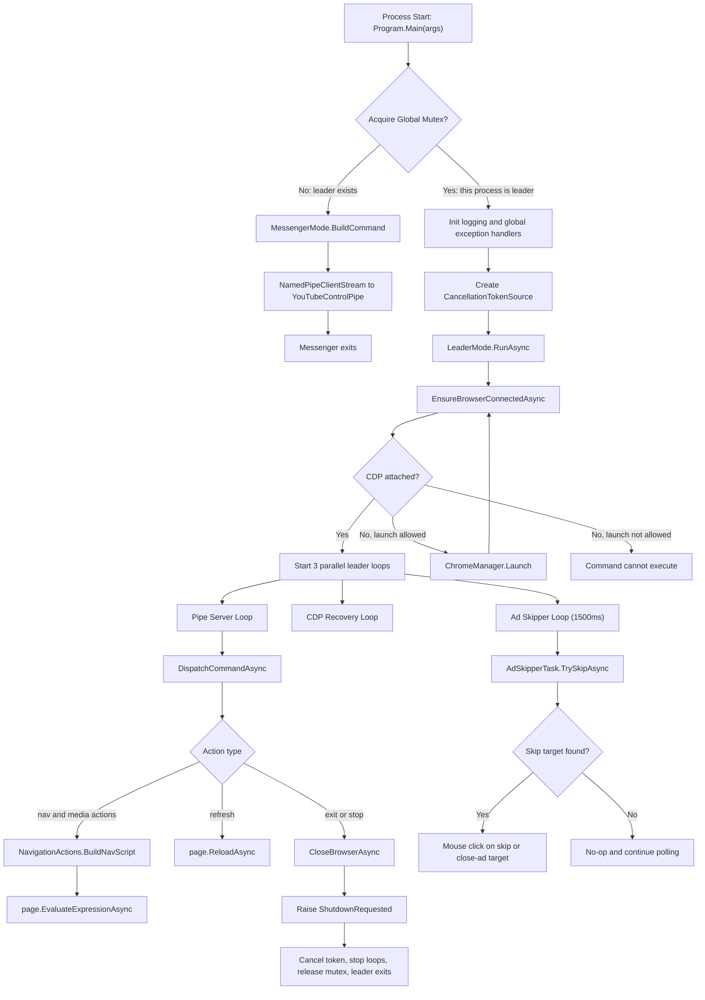

# System State (Current, src)

This document captures the currently implemented runtime state for the code under src, based on the V7 C# implementation.

## Scope

- Repository area covered: src/YouTubeControl
- Runtime style: single WinExe running in dual mode (Leader or Messenger)
- IPC: local named pipe (YouTubeControlPipe)
- Leader election: global mutex (Global\\YouTubeControl_Leader_Mutex)
- Browser control: Chrome DevTools Protocol via PuppeteerSharp on port 15432

## Main Runtime Components

- Program.cs
- Process startup, global exception handlers, leader election, and shutdown token wiring.
- If mutex is not acquired, process acts as Messenger and forwards command to Leader.
- If mutex is acquired, process starts LeaderMode and stays resident.

- MessengerMode.cs
- Combines CLI args into one command line.
- Sends one line over named pipe and exits quickly.

- LeaderMode.cs
- Owns the active browser session and command dispatch pipeline.
- Runs three concurrent loops:
  - Pipe server loop (receive and dispatch commands)
  - CDP recovery loop (reattach when session drops)
  - Ad skipper loop (polls every 1500 ms)
- Supports actions:
  - home, up, down, enter, back, play_pause, fullscreen, toggle, like, search, open, refresh, exit, stop
- stop is normalized to exit.

- ChromeManager.cs
- Resolves Chrome binary path (Canary fallback to Stable).
- Launches Chrome with remote debugging port 15432 and a fixed user data directory:
  - C:\\Grid3_YouTube_Accessibility_Addon_User_Data

- Actions/NavigationActions.cs
- Provides the browser-side JavaScript script used for navigation, focus highlighting, media controls, and activation.

- Actions/AdSkipperTask.cs
- Executes browser-side selector checks for skip/close-ad targets.
- Clicks the target when found on watch/shorts pages.

- Logger.cs
- Thread-safe file logger with fallback log file behavior.

- Models/AppConfig.cs
- Exists and can load config.json defaults.
- Current runtime state: not referenced by startup/ChromeManager flow in the active code path.

## Current Command Lifecycle

1. Grid 3 (or any caller) starts YouTubeControl.exe with or without args.
2. Program attempts mutex acquisition.
3. If leader already exists, process runs MessengerMode and sends command to named pipe.
4. Leader receives command, validates action, resolves page, executes command via CDP.
5. Messenger exits immediately; Leader continues resident until exit/stop or shutdown.

## Mermaid Flowchart

## Operational Notes (Current State)

- Leader is single-instance by mutex; Messenger is intentionally short-lived.
- Named pipe is the only command transport (no runtime HTTP command server in V7).
- Browser reconnect/retry logic is present for transient CDP session failures.
- Exit flow closes tabs/window and requests graceful shutdown.
- Logs are written to logs.txt in the app base directory, with temp fallback if needed.
