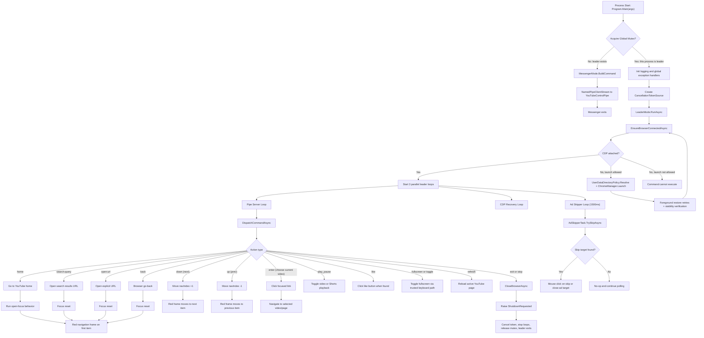
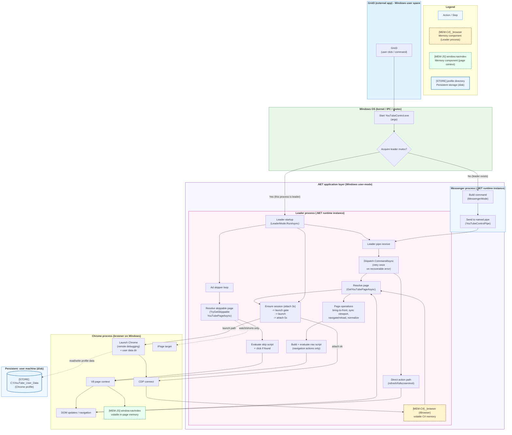

# System State (Current, src)

This document captures the currently implemented runtime state for the code under src, based on the V7 C# implementation.

## Scope

- Repository area covered: src/YouTubeControl
- Runtime style: single WinExe running in dual mode (Leader or Messenger)
- IPC: local named pipe (YouTubeControlPipe)
- Leader election: global mutex (Global\\YouTubeControl_Leader_Mutex)
- Browser control: Chrome DevTools Protocol via PuppeteerSharp on port 15432

## Main Runtime Components

- Program.cs
- Process startup, global exception handlers, leader election, and shutdown token wiring.
- If mutex is not acquired, process acts as Messenger and forwards command to Leader.
- If mutex is acquired, process starts LeaderMode and stays resident.

- MessengerMode.cs
- Combines CLI args into one command line.
- Sends one line over named pipe and exits quickly.

- LeaderMode.cs
- Owns the active browser session and command dispatch pipeline.
- Runs three concurrent loops:
  - Pipe server loop (receive and dispatch commands)
  - CDP recovery loop (reattach when session drops)
  - Ad skipper loop (polls every 1500 ms)
- Supports actions:
  - home, up, down, enter, back, play_pause, fullscreen, toggle, like, search, open, refresh, exit, stop
- stop is normalized to exit.

- ChromeManager.cs
- Resolves Chrome binary path (Canary fallback to Stable).
- Uses UserDataDirectoryPolicy to resolve the runtime profile directory.
- Launches Chrome with remote debugging port 15432 and a canonical user data directory:
  - C:\\YouTube_User_Data
- Restores foreground window after launch using retry + stability checks and a final-pass fallback.

- UserDataDirectoryPolicy.cs
- Selects preferred profile directory with this order:
  - Use canonical path directly when existing profile data is found.
  - Migrate legacy profile from `%LOCALAPPDATA%\YouTubeControl` if it exists.
  - Bootstrap first install at C:\\YouTube_User_Data when no profile data exists.

- Actions/NavigationActions.cs
- Provides the browser-side JavaScript script used for navigation, focus highlighting, media controls, and activation.

- Actions/AdSkipperTask.cs
- Executes browser-side selector checks for skip/close-ad targets.
- Clicks the target when found on watch/shorts pages.

- Logger.cs
- Thread-safe file logger with fallback log file behavior.

- Models/AppConfig.cs
- Exists and can load config.json defaults.
- Current runtime state: not referenced by startup/ChromeManager flow in the active code path.

## Current Command Lifecycle

1. Grid 3 (or any caller) starts YouTubeControl.exe with or without args.
2. Program attempts mutex acquisition.
3. If leader already exists, process runs MessengerMode and sends command to named pipe.
4. If Leader needs a browser launch, it resolves the user-data path via UserDataDirectoryPolicy, launches Chrome, then runs foreground-restore verification.
5. Leader receives command, validates action, resolves page, executes command via CDP.
6. Messenger exits immediately; Leader continues resident until exit/stop or shutdown.

## Mermaid Flowchart

## User Actions and Visible Effects

- home: opens YouTube home and applies focus reset with red navigation frame on the first navigable item.
- search:query: opens search results and resets focus with red navigation frame.
- open:url: opens the given URL and resets focus with red navigation frame when a navigable list is available.
- back: browser back navigation and focus reset with red navigation frame.
- down (next): moves to next item in list navigation.
- up (prev): moves to previous item in list navigation.
- enter (choose current video): clicks the currently focused item (thumbnail/title link).
- play_pause: toggles play/pause in standard video or Shorts context.
- like: clicks like action when selector is found.
- fullscreen and toggle: toggles fullscreen state.
- refresh: reloads active YouTube page.
- exit and stop: closes browser and requests leader shutdown.

Navigation frame details:
- Implemented by browser-side highlight styling in NavigationActions (8px red outline).
- Frame is reset/cleared and reapplied on focus-changing actions.

## Operational Notes (Current State)

- Leader is single-instance by mutex; Messenger is intentionally short-lived.
- Named pipe is the only command transport (no runtime HTTP command server in V7).
- Profile policy uses canonical path C:\\YouTube_User_Data with legacy migration support.
- Browser reconnect/retry logic is present for transient CDP session failures.
- Foreground restore is launch-time hardened with retries, stability checks, and final-pass attempt logging.
- Exit flow closes tabs/window and requests graceful shutdown.
- Logs are written to logs.txt in the app base directory, with temp fallback if needed.

## End-to-end flow: Grid3 click → V8 injection (diagram and locations)

Below is a flowchart that shows the end-to-end command/runtime path from Grid3 (or another caller) through the YouTubeControl process into the browser page where JavaScript is evaluated in V8. The diagram also marks where key state is stored (server-side `IBrowser`, in-page `window.navIndex`, and the Chrome user-data directory on disk).

Legend — where things run / what stores state:
- Node markers at the top of the diagram:
  - `[MEM-C#]` marks `_browser` as a memory component in the Leader .NET process (not an action).
  - `[MEM-JS]` marks `window.navIndex` as a memory component in the page JavaScript context (not an action).
  - `[STORE]` marks persistent storage on disk (not volatile RAM).
- Grid3: external assistive app (Windows user space) that launches or signals `YouTubeControl.exe`.
- Windows OS: global mutex and named pipe are Win32 concepts implemented by the OS; the mutex enforces single leader and the named pipe (`YouTubeControlPipe`) transports commands.
- .NET application layer (Windows user-mode): shown as one outer group with two inner groups, each representing a separate process/runtime instance:
  - Messenger process (.NET runtime instance): current process is not leader, so it only builds and sends one command to the existing leader via named pipe.
  - Leader process (.NET runtime instance): when elected leader, starts runtime loops and bootstraps browser/session; command dispatch happens when pipe commands arrive.
- Chrome process (Windows): the Chrome browser process is launched by `ChromeManager.Launch` with `--remote-debugging-port=15432` and stores profile data under `C:\\YouTube_User_Data` (persistent on disk).
- V8 / renderer: the injected JS executes inside the renderer process (V8), where `window.navIndex` and DOM state live (volatile in renderer memory).
- Connection robustness (summarized in `Ensure session`): attach attempts happen before and after launch with backoff.
- Script evaluation is action-dependent: navigation actions use the injected nav script, while refresh/fullscreen/exit use direct command-specific paths.
- Ad skipper path is intentionally separate and parallel to command intake: it resolves skippable pages (watch/shorts filter) without waiting for pipe commands.

About the `style` lines you saw:
- Those are Mermaid styling directives intended to change node appearance (for example fill and border). They are not separate diagram boxes — they are instructions for the Mermaid renderer.
- This diagram now uses automatic node sizing by text content (no fixed width/height directives).

If you want nodes to always show full text reliably across renderers, I can:
- split long labels into multiple lines (already done using `\n`), or
- wrap nodes in subgraphs with fixed-size containers (some renderers will respect that better), or
- generate an exported PNG/SVG here if you want a guaranteed visual.

Next step: would you like a separate mini-diagram for error recovery (CDP disconnect → `InvalidateBrowserAsync` → reconnect attempts) or a rendered image of this diagram?

