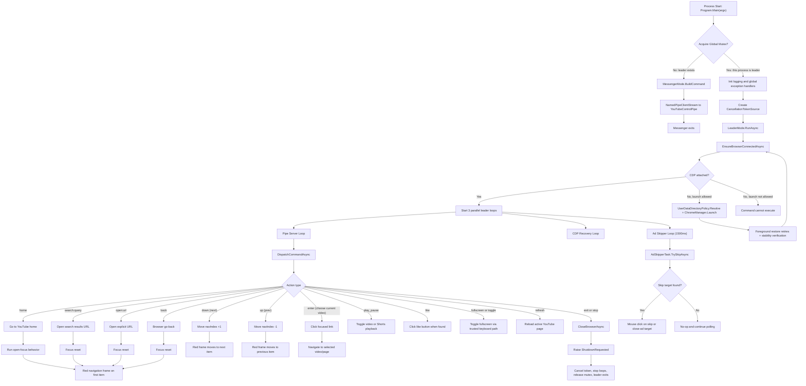
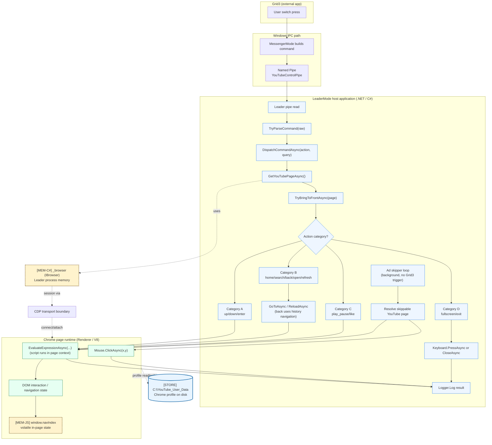

# System State (Current, src)

This document captures the currently implemented runtime state for the code under src, based on the V7 C# implementation.

## Scope

- Repository area covered: src/YouTubeControl
- Runtime style: single WinExe running in dual mode (Leader or Messenger)
- IPC: local named pipe (YouTubeControlPipe)
- Leader election: global mutex (Global\\YouTubeControl_Leader_Mutex)
- Browser control: Chrome DevTools Protocol via PuppeteerSharp on port 15432

## Main Runtime Components

Components are listed in runtime order (startup -> leader runtime -> browser/profile -> automation -> infrastructure).

| Layer | Component | Responsibility |
|---|---|---|
| Startup and election | Program.cs | Initializes logging and global handlers, attempts global mutex acquisition, and routes process mode. |
| Leader runtime | LeaderMode.cs | Owns browser session and command dispatch. Runs three concurrent loops: pipe server, CDP recovery, and ad skipper (1500 ms). |
| Messenger relay | MessengerMode.cs | Builds a single command line from CLI args, sends it over named pipe, and exits quickly. |
| Browser lifecycle | ChromeManager.cs | Resolves Chrome binary (Canary -> Stable), launches with remote debugging port 15432, and performs hardened foreground restore checks. |
| Profile policy | UserDataDirectoryPolicy.cs | Resolves profile path with policy order: existing canonical profile -> legacy migration from `%LOCALAPPDATA%\YouTubeControl` -> first-install bootstrap at C:\\YouTube_User_Data. |
| Browser navigation script | Actions/NavigationActions.cs | Provides the browser-side JavaScript used for focus management, navigation, and media controls. |
| Background ad handling | Actions/AdSkipperTask.cs | Polls YouTube pages for skip/close-ad targets and clicks when found. |
| Infrastructure | Logger.cs | Thread-safe file logging with temp fallback. |
| Configuration model | Models/AppConfig.cs | Config schema and loader for config.json defaults; currently a placeholder not yet used in the active startup/ChromeManager path. |

LeaderMode action vocabulary:

| Action | Notes |
|---|---|
| home, up, down, enter, back, play_pause, fullscreen, toggle, like, search, open, refresh, exit, stop | Supported action set in current runtime. |
| stop | Normalized to exit. |

## Current Command Lifecycle

Text summary aligned to the flowchart below:

1. Caller starts YouTubeControl.exe with or without args.
2. Program attempts mutex acquisition.
3. If leader already exists, process runs MessengerMode, sends one command to named pipe, and exits.
4. If this process becomes Leader, it ensures browser connectivity (including profile resolution and launch when required).
5. Leader validates and dispatches actions via CDP, while staying resident until exit/stop or shutdown.

## Mermaid Flowchart

## User Actions and Visible Effects

| Action | Category | Visible effect |
|---|---|---|
| home | Navigation | Opens YouTube home and resets focus to the first navigable item (red frame). |
| search:query | Navigation | Opens search results and resets focus (red frame). |
| open:url | Navigation | Opens explicit URL and resets focus when a navigable list is available. |
| back | Navigation | Goes back in browser history and resets focus (red frame). |
| down (next) | Stateful navigation | Moves focus to the next item in list navigation. |
| up (prev) | Stateful navigation | Moves focus to the previous item in list navigation. |
| enter (choose current video) | Stateful navigation | Clicks currently focused item (thumbnail/title link). |
| play_pause | Media control | Toggles play/pause in standard video or Shorts context. |
| like | Media control | Clicks the like action when selector is found. |
| fullscreen | System-level action | Toggles fullscreen state. |
| toggle | System-level action | Toggles fullscreen state. |
| refresh | Navigation | Reloads active YouTube page. |
| exit | Shutdown | Closes browser and requests leader shutdown. |
| stop | Shutdown | Alias of exit (normalized to exit). |

Navigation frame details:
- Implemented by browser-side highlight styling in NavigationActions (8px red outline).
- Frame is reset/cleared and reapplied on focus-changing actions.

## Operational Notes (Current State)

- Leader is single-instance by mutex; Messenger is intentionally short-lived.
- Named pipe is the only command transport (no runtime HTTP command server in V7).
- Profile policy uses canonical path C:\\YouTube_User_Data with legacy migration support.
- Browser reconnect/retry logic is present for transient CDP session failures.
- Foreground restore is launch-time hardened with retries, stability checks, and final-pass attempt logging.
- Exit flow closes tabs/window and requests graceful shutdown.
- Logs are written to logs.txt in the app base directory, with temp fallback if needed.

## End-to-end flow: Grid3 click → V8 injection (diagram and locations)

Below is the updated command/runtime map with explicit execution boundaries between the LeaderMode host process and the Browser/V8 environment reached through CDP.

Location map and execution boundaries:

Shared flow (all actions):

| Step | Host location | Notes |
|---|---|---|
| Command ingress | MessengerMode + YouTubeControlPipe | Grid3 trigger enters through named pipe transport. |
| Parse and dispatch | LeaderMode.cs (`TryParseCommand(...)` -> `DispatchCommandAsync(...)`) | Host validates and routes action. |
| Page resolution and focus | LeaderMode.cs (`GetYouTubePageAsync(...)`, `TryBringToFrontAsync(...)`) | Ensures active target page before execution. |
| Outcome logging | Logger (`Logger.Log(...)`) | Result is recorded after each execution path. |

Category execution map:

| Category | Actions | Primary host path | Browser/V8 execution boundary |
|---|---|---|---|
| A: Stateful DOM navigation | up, down, enter | Host routes action and calls `page.EvaluateExpressionAsync<string>(...)`. | Script runs in page/V8 and mutates DOM state, including `window.navIndex`. |
| B: URL navigation | home, search, back, open, refresh | Host uses `page.GoToAsync(...)`, `page.ReloadAsync()`, and `page.GoBackAsync()` for back. | Focus/normalization script continues via `EvaluateExpressionAsync(...)` in V8. |
| C: Stateless page actions | play_pause, like | Host calls `EvaluateExpressionAsync(...)` only. | Player/element interaction runs entirely in page/V8 context. |
| D: System-level actions | fullscreen, exit | Host uses `page.Keyboard.PressAsync(...)` for fullscreen and page/browser close APIs for exit. | Host-initiated browser control path (not DOM-navigation script path). |

Background automation map:

| Flow | Host path | Browser/V8 execution boundary |
|---|---|---|
| Ad skip loop (no Grid3 trigger) | `AdSkipperTask.TrySkipAsync(...)` | Detects skip target via `EvaluateExpressionAsync(...)`, then clicks via `page.Mouse.ClickAsync(...)`. |

State locations:

| State | Location |
|---|---|
| [MEM-C#] _browser | Leader process memory |
| [MEM-JS] window.navIndex | Renderer/V8 memory |
| [STORE] C:\YouTube_User_Data | Persistent Chrome profile storage on disk |

