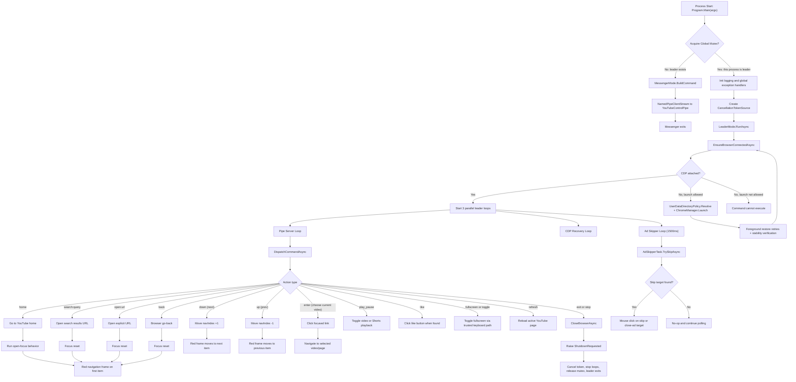
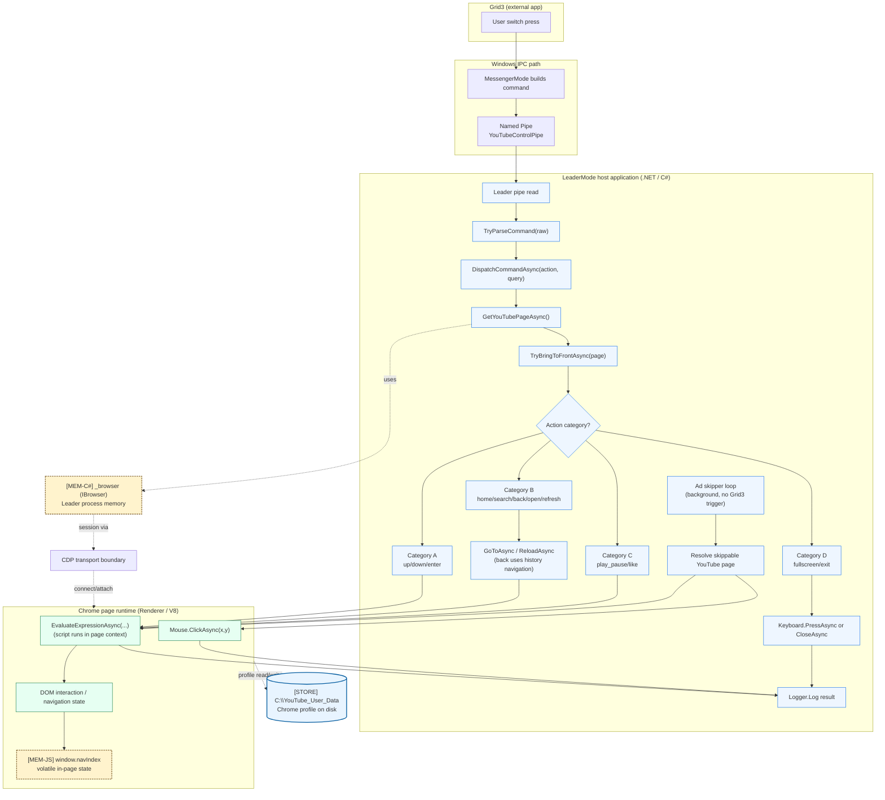

# System State (Current, src)

This document captures the currently implemented runtime state for the code under src, based on the V7 C# implementation.

## Scope

- Repository area covered: src/YouTubeControl
- Runtime style: single WinExe running in dual mode (Leader or Messenger)
- IPC: local named pipe (YouTubeControlPipe)
- Leader election: global mutex (Global\\YouTubeControl_Leader_Mutex)
- Browser control: Chrome DevTools Protocol via PuppeteerSharp on port 15432

## Main Runtime Components

- Program.cs
- Process startup, global exception handlers, leader election, and shutdown token wiring.
- If mutex is not acquired, process acts as Messenger and forwards command to Leader.
- If mutex is acquired, process starts LeaderMode and stays resident.

- MessengerMode.cs
- Combines CLI args into one command line.
- Sends one line over named pipe and exits quickly.

- LeaderMode.cs
- Owns the active browser session and command dispatch pipeline.
- Runs three concurrent loops:
  - Pipe server loop (receive and dispatch commands)
  - CDP recovery loop (reattach when session drops)
  - Ad skipper loop (polls every 1500 ms)
- Supports actions:
  - home, up, down, enter, back, play_pause, fullscreen, toggle, like, search, open, refresh, exit, stop
- stop is normalized to exit.

- ChromeManager.cs
- Resolves Chrome binary path (Canary fallback to Stable).
- Uses UserDataDirectoryPolicy to resolve the runtime profile directory.
- Launches Chrome with remote debugging port 15432 and a canonical user data directory:
  - C:\\YouTube_User_Data
- Restores foreground window after launch using retry + stability checks and a final-pass fallback.

- UserDataDirectoryPolicy.cs
- Selects preferred profile directory with this order:
  - Use canonical path directly when existing profile data is found.
  - Migrate legacy profile from `%LOCALAPPDATA%\YouTubeControl` if it exists.
  - Bootstrap first install at C:\\YouTube_User_Data when no profile data exists.

- Actions/NavigationActions.cs
- Provides the browser-side JavaScript script used for navigation, focus highlighting, media controls, and activation.

- Actions/AdSkipperTask.cs
- Executes browser-side selector checks for skip/close-ad targets.
- Clicks the target when found on watch/shorts pages.

- Logger.cs
- Thread-safe file logger with fallback log file behavior.

- Models/AppConfig.cs
- Exists and can load config.json defaults.
- Current runtime state: not referenced by startup/ChromeManager flow in the active code path.

## Current Command Lifecycle

1. Grid 3 (or any caller) starts YouTubeControl.exe with or without args.
2. Program attempts mutex acquisition.
3. If leader already exists, process runs MessengerMode and sends command to named pipe.
4. If Leader needs a browser launch, it resolves the user-data path via UserDataDirectoryPolicy, launches Chrome, then runs foreground-restore verification.
5. Leader receives command, validates action, resolves page, executes command via CDP.
6. Messenger exits immediately; Leader continues resident until exit/stop or shutdown.

## Mermaid Flowchart

## User Actions and Visible Effects

- home: opens YouTube home and applies focus reset with red navigation frame on the first navigable item.
- search:query: opens search results and resets focus with red navigation frame.
- open:url: opens the given URL and resets focus with red navigation frame when a navigable list is available.
- back: browser back navigation and focus reset with red navigation frame.
- down (next): moves to next item in list navigation.
- up (prev): moves to previous item in list navigation.
- enter (choose current video): clicks the currently focused item (thumbnail/title link).
- play_pause: toggles play/pause in standard video or Shorts context.
- like: clicks like action when selector is found.
- fullscreen and toggle: toggles fullscreen state.
- refresh: reloads active YouTube page.
- exit and stop: closes browser and requests leader shutdown.

Navigation frame details:
- Implemented by browser-side highlight styling in NavigationActions (8px red outline).
- Frame is reset/cleared and reapplied on focus-changing actions.

## Operational Notes (Current State)

- Leader is single-instance by mutex; Messenger is intentionally short-lived.
- Named pipe is the only command transport (no runtime HTTP command server in V7).
- Profile policy uses canonical path C:\\YouTube_User_Data with legacy migration support.
- Browser reconnect/retry logic is present for transient CDP session failures.
- Foreground restore is launch-time hardened with retries, stability checks, and final-pass attempt logging.
- Exit flow closes tabs/window and requests graceful shutdown.
- Logs are written to logs.txt in the app base directory, with temp fallback if needed.

## End-to-end flow: Grid3 click → V8 injection (diagram and locations)

Below is the updated command/runtime map with explicit execution boundaries between the LeaderMode host process and the Browser/V8 environment reached through CDP.

Location map and execution boundaries:
- Shared flow for all actions:
  - Grid3 trigger enters YouTubeControl through `MessengerMode` and `YouTubeControlPipe` (named pipe transport).
  - Parsing and routing occur in `LeaderMode.cs` via `TryParseCommand(...)` then `DispatchCommandAsync(...)`.
  - Active-tab resolution and focusing occur in `LeaderMode.cs` via `GetYouTubePageAsync(...)` and `TryBringToFrontAsync(...)`.
  - Command outcomes are logged from the host (`Logger.Log(...)`) after each execution path.
- Category A: Stateful DOM navigation (`up`, `down`, `enter`):
  - Host builds route and invokes `page.EvaluateExpressionAsync<string>(...)`.
  - Script executes inside V8/page context and updates DOM state (including `window.navIndex`).
- Category B: URL navigation (`home`, `search`, `back`, `open`, `refresh`):
  - Host-side navigation uses `page.GoToAsync(...)` and `page.ReloadAsync()`.
  - `back` uses history navigation (`page.GoBackAsync()`), then action script continues through `EvaluateExpressionAsync(...)` for focus/normalization behavior.
  - Resulting script/DOM work still runs inside V8.
- Category C: Stateless page actions (`play_pause`, `like`):
  - Host invokes `EvaluateExpressionAsync(...)` only.
  - Player/element interaction executes entirely in the V8 page context.
- Category D: System-level actions (`fullscreen`, `exit`):
  - `fullscreen` uses browser-level input through `page.Keyboard.PressAsync(...)` (with state check around fullscreen state).
  - `exit` closes page/browser via `page.CloseAsync()` and `browser.CloseAsync()`.
  - These are host-initiated browser control operations, not DOM-nav script paths.
- Background automated action (no Grid3 trigger):
  - Ad skip loop runs independently from command intake.
  - `AdSkipperTask.TrySkipAsync(...)` uses `EvaluateExpressionAsync(...)` to detect a skip/close target and `page.Mouse.ClickAsync(...)` to perform the click.
- State locations:
  - `[MEM-C#] _browser` is in Leader process memory.
  - `[MEM-JS] window.navIndex` is in renderer/V8 memory.
  - `[STORE] C:\YouTube_User_Data` is persistent Chrome profile storage on disk.

